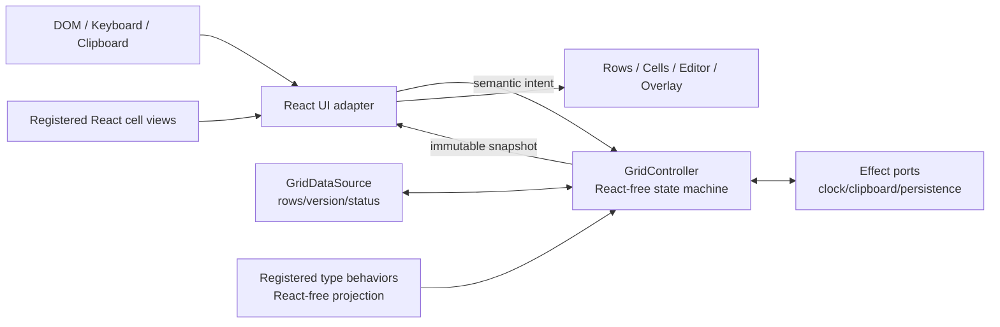

# 业务数据批量编辑器 v2 设计与实施方案

> 状态：M5 test candidate ready（等待用户验收）
> 最后更新：2026-08-31
> 当前阶段：M1–M4 技术完成；M5 实现与独立复核完成，等待用户体验验收；M6 永久 v2 回归测试尚未开始，并按用户要求推迟到功能确认后
> 适用范围：用自有状态机和 React UI 实现完整替换 `react-data-grid` 的业务数据批量编辑器

## 1. 目标与完成条件

v2 的目标不是把旧组件中的 `react-data-grid` 一层层拆掉，也不是建设一个以 100k 行客户端渲染为主要卖点的 BigTable renderer。它是面向真实业务数据的开箱即用批量编辑器：重点是让用户可靠、高效地选择、批量修改、校验、保存和恢复业务数据。归档的 legacy 实现只作为行为参考、缺陷样本和回归基线，不作为 v2 的代码骨架。

最终用户应当只需要提供：

1. 一个数据源，负责权威数据、行标识和持久化；
2. 一个单元格类型注册表，负责所有值类型的显示、编辑和批量行为；
3. 一组列定义。

Grid 自己负责布局、焦点、选择、编辑、剪贴板、填充、筛选、排序、dirty 展示、行操作、错误恢复和基础样式。string、number、date、image 只是包提供的标准 type factory，必须和应用自定义 type 一样显式注册并走同一条能力链路。宿主不应重新拼装这些能力。

首发规模边界是“数据源当前加载的一组可批量编辑业务数据”，不是“浏览器持有完整超大数据集”。如果业务确实需要大规模数据，分页、窗口加载、服务端筛选/排序和跨窗口批量命令必须由 data source 协作提供；仅在 renderer 中加入虚拟化无法解决取数、筛选、选择、粘贴和持久化的整体成本。

产品优先级按以下顺序判断取舍：

1. 批量选择、编辑、校验、提交和恢复是否可靠且好用；
2. 标准和应用 type 能否获得完全一致的能力；
3. 状态和异步生命周期能否由一个 React-free controller 清楚解释；
4. 默认 UI 是否真正开箱即用且不会出现 layout shift、误触或输入丢失；
5. 在真实业务 fixture 上是否足够流畅；
6. 最后才是脱离 data source 场景的极端 renderer scale。

v2 只有同时满足以下条件才算完成：

- 运行时代码、类型、CSS、测试和包依赖中不再包含 `react-data-grid`；
- 首发功能清单中的所有 P0 能力完成并有对应验证；
- 当前 demo 的核心工作流全部可以在 v2 中完成；
- string、number、date、image 和自定义类型全部通过同一个显式 registry 注册，没有内核特殊分支；
- 选择、编辑、草稿、view、history 和持久化语义由 React-free controller/state machine 持有；
- 单元格、行、列和全表选择共享同一个交互状态机；
- 编辑、粘贴、清除、填充、批量编辑和行操作都通过同一个原子变更入口；
- immediate、手动保存和自动保存模式都经过失败、重试、并发编辑和远端刷新验证；
- Playwright 在 1440、1920、2560、3840 四种桌面宽度下完成主要工作流验证；
- 最终切换后删除旧实现、兼容实验和 `.rdg-*` 选择器，不保留两套生产路径。

## 2. 为什么需要重新设计

当前版本已经证明了数据源、草稿引擎和类型注册机制的方向是可行的，但 UI 层的职责边界不成立：

- `react-data-grid` 的类型泄漏到了排序、编辑器、行更新和公开组件 props；
- 多选、行列选择、右键菜单、填充锚点和 overlay 必须绕过底层网格自行定位；
- 单元格、行号和列头曾经各自拥有相似但不一致的 pointer 逻辑；
- 编辑器生命周期同时受 Grid、浏览器 input 和外层选择状态影响；
- `.rdg-*` DOM class 已经成为样式和测试契约；
- 为修复末行溢出、边框居中、层级和 layout shift，需要持续对第三方 DOM 做补偿。

新设计会让布局坐标、交互状态和 DOM 层级都由同一个实现拥有，从根源上消除这些冲突。

## 3. 设计原则

### 3.1 Greenfield，而不是兼容层

- 开发启动时先把当前 `src/` 整体改名为 `src-legacy/`，随后创建全新的 `src/` 作为 v2 正式目录。
- 新 `src/` 不从 `src-legacy/` 或 `react-data-grid` 导入代码；旧目录只作为可运行行为参考。
- 可以参考并重新实现经过验证的纯算法，例如 TSV 解析、dirty baseline 和乐观并发规则。
- 任何被移植的算法都必须先适配 v2 契约；功能行为确认后再为最终契约补独立测试，不能为复用而保留旧类型。
- 不创建临时 `src/v2/`，避免完成后再搬一次目录和 import。
- 迁移期间 `src-legacy/` 只负责旧 demo、行为对照和验收样本；切换后完整删除。

### 3.2 一个内部状态机

活动单元格、范围选择、行列选择、编辑、右键目标、填充拖拽、草稿事务、view 状态和持久化调度不能再分别散落在 React hooks 中。v2 提供一个 React-free `GridController`/state machine：所有 pointer、keyboard、clipboard 和 data-source 事件先解析成语义 intent，再进入统一 dispatcher/reducer/effect 流程。

React 只负责：

- 把 DOM 事件转换为 controller intent；
- 通过 `useSyncExternalStore` 订阅不可变 snapshot；
- 渲染 cell、editor、overlay 和 portal；
- 提供 ResizeObserver、focus、pointer capture 等 DOM effect adapter。

selection、edit session、dirty、filter、sort、menu target 或 save status 不使用独立 `useState` 作为权威来源。React ref 可以保存 DOM node 和不影响产品语义的瞬时测量值。

### 3.3 一个数据变更入口

任何本地数据修改都表达为明确命令，经过以下同一条链路：

```text
预检 -> 类型解析/权限/校验 -> 原子草稿事务 -> history -> dirty -> 持久化调度
```

不允许 renderer、菜单、编辑器或 toolbar 直接绕开草稿和持久化边界修改 rows。

### 3.4 批量编辑优先，规模能力由 data source 协作

- v2 保持固定数据行高，让选择几何、编辑器和滚动行为简单且稳定；首发不支持动态行高。
- 首发可以直接渲染 data source 已加载的完整业务数据集，不为任意超大客户端数据集提前增加虚拟化复杂度。
- 性能优化以真实业务 fixture 和 profiling 为依据，优先避免无意义的全表重算和 React 重渲染。
- 超大数据量首先扩展 data-source window/pagination、服务端 view 和 declarative bulk command；可选 row virtualization 只是其中一个渲染优化，不是完整方案。

### 3.5 开箱即用但保持可扩展

- 包提供完整基础样式、默认 toolbar、搜索、筛选面板、排序按钮、状态区和菜单。
- 类型差异放在单元格适配器中；后端差异放在数据源 capability 中。
- 宿主可以替换 action surface、文案和主题，但不需要替换核心交互。

### 3.6 正确性优先于视觉上的即时成功

- 批量操作先完整预检，任意一个目标失败就不提交部分结果。
- 编辑器不在解析或校验失败时关闭。
- 持久化没有确认前不清 dirty、不报告保存成功。
- 远端刷新与本地草稿冲突时显式进入可恢复状态。

### 3.7 先确认功能，再固化自动化测试

交互和 API 尚未确认时，不用测试代码提前冻结猜测出来的行为。开发顺序是：

```text
实现一个完整垂直功能切片
-> 在新 demo 中实际操作
-> 用 Playwright 做探索式浏览器验证并检查 console/runtime
-> 根据反馈修改交互和契约
-> 确认满足预期
-> 再写永久 unit / integration / E2E 回归测试
```

- M1–M5 不以“先写测试”作为开工条件，也不为了临时实现堆积大量即将重写的 selector/assertion。
- 功能确认前仍然运行 typecheck、lint、build，并使用 Playwright 实际走 UI；“暂不写永久测试”不等于不验证运行结果。
- 探索验证脚本、调试日志和临时断言不进入最终代码。
- 一个功能切片一旦确认，便可以立即进入回归测试队列，不必等全部功能完成。
- 最终切换仍以确认后的完整 unit/integration/Playwright suite 全绿为必要条件。

## 4. 功能范围

优先级定义：

- **P0**：v2 切换前必须完成；
- **P1**：v2.1 计划，不阻塞首发，但架构不能阻止后续实现；
- **不做**：当前明确排除，避免把首发变成通用 spreadsheet 工程。

### 4.1 基础网格与布局

| ID | 优先级 | 功能 | 验收结果 |
| --- | --- | --- | --- |
| G-01 | P0 | 自研 Grid DOM 和布局 | 源码、声明、CSS 和运行时均不依赖 `react-data-grid` |
| G-02 | P0 | 完整基础样式 | 引入包的 CSS 后即可得到可用的 header、cell、editor、toolbar、menu、状态样式 |
| G-03 | P0 | 固定行高业务数据表面 | 所有已加载行使用统一 row height，选择、编辑器和行号几何稳定 |
| G-04 | P0 | 真实业务规模性能 | 常用编辑、批量操作和滚动不做无关全表重算；以实际业务 fixture profiling 验收，不承诺任意超大客户端数据集 |
| G-05 | P0 | 自有列布局 | 支持 `basis/min/max/flex`，窄容器横向滚动，宽屏合理分配剩余空间 |
| G-06 | P0 | 固定行号列和 corner 全选入口 | 行号随横向滚动保持固定，corner 不显示 `#`，点击选择全部已加载且可见的单元格 |
| G-07 | P0 | 边缘交互面完整覆盖 | 列头、行号和图片的交互背景到达 cell 边界，不因默认内容 padding 短一截或保留右侧空隙 |
| G-08 | P0 | 稳定的 header/body 滚动同步 | header、单元格、选择边框和行号在双向滚动时保持对齐 |
| G-09 | P0 | 操作状态 | 明确区分首次加载、保留数据刷新、成功有数据、成功空、筛选无结果、失败无数据、失败有旧数据 |
| G-10 | P0 | 容器驱动尺寸 | 组件填满宿主容器，不使用约 1000px 的桌面上限 |
| G-11 | P1 | data-source window/pagination | 大数据模式明确 loaded window、total、view revision 和加载状态，不假装客户端拥有全部 rows |
| G-12 | P1 | 可选已加载窗口虚拟化 | 只有 profiling 证明 DOM 是瓶颈时加入，且不改变 selection/edit/data-source 语义 |
| G-13 | P1 | 用户拖拽调整列宽 | 通过统一列几何更新，不改变 selection/edit session |
| G-14 | P1 | 数据列冻结 | 首发只固定行号列，后续允许冻结指定数据列 |
| G-15 | P1 | 列重排和持久化布局 | 列 key 稳定，布局状态可受控 |

### 4.2 活动焦点与选择

| ID | 优先级 | 功能 | 验收结果 |
| --- | --- | --- | --- |
| S-01 | P0 | 单元格活动焦点 | pointer down 立即激活；方向键移动；焦点与视觉边框一致 |
| S-02 | P0 | 连续矩形选择 | pointer 拖拽或 Shift 扩展，活动锚点和范围可预测 |
| S-03 | P0 | 不连续多选 | Ctrl/⌘ 增加范围；重复区域不会重复计算 selected cell count |
| S-04 | P0 | 行选择与行多选 | 行号 down 时立即选中，拖动、Shift、Ctrl/⌘ 与单元格选择语义一致 |
| S-05 | P0 | 列选择与列多选 | 点击列标题默认选择列；排序只由显式按钮触发 |
| S-06 | P0 | 全选 | corner 选择全部可见、可选择的单元格 |
| S-07 | P0 | 统一 pressed 反馈 | 单元格、行号、列头在 pointer down 时使用同一选中反馈，不先闪 active outline |
| S-08 | P0 | 取消选择 | Escape/外部交互按明确规则取消；边框、锚点、菜单和 toolbar target 同步消失 |
| S-09 | P0 | 拖拽自动滚动 | 选择或填充接近 viewport 边缘时按距离滚动，pointer capture 保持手势 |
| S-10 | P0 | 禁止误选文本 | table 表面 `user-select: none`，仅 editor、筛选输入等真实文本控件恢复 text selection |
| S-11 | P0 | 选择摘要 | 报告去重后的行、列、单元格数量以及操作上限 |

选择规则：

- 行、列、corner 最终都被转换成普通矩形范围，不建立第二套 row selection 状态。
- 活动范围是最后一次创建或扩展的范围；填充锚点只属于活动矩形范围。
- 右键点击选区内部时保留选区；右键点击外部单元格时先选择目标，再解析菜单。
- 排序、筛选或列集合改变会结束正在进行的手势。建议保留仍可见的单活动单元格，但清除多范围选择，避免同一对端点在新顺序中代表另一批数据。
- 数据刷新但顺序未改变时按 row key/column key 保留活动位置；目标被删除时移动到最近的可见单元格。

### 4.3 编辑器与输入法

| ID | 优先级 | 功能 | 验收结果 |
| --- | --- | --- | --- |
| E-01 | P0 | 一等编辑会话 | 明确保存 `originalValue`、`draftValue`、`status`、`composing`，编辑中不直接写 rows |
| E-02 | P0 | 常规打开方式 | 双击、Enter、F2 打开；可选支持可打印字符直接替换并开始编辑 |
| E-03 | P0 | 柔和的全单元格 editor | 默认 editor 继承单元格尺寸、字体、padding 和背景，不出现生硬的内嵌 input 边框 |
| E-04 | P0 | 原子提交与取消 | Enter/Tab/选择其他单元格提交一次；Escape 恢复原值；失败时保留输入和焦点 |
| E-05 | P0 | IME 安全 | `compositionstart` 到 `compositionend` 期间 Grid 不拦截 Enter、方向键或卸载 editor |
| E-06 | P0 | 编辑导航 | Enter、Tab、Shift+Tab 提交后移动；方向键行为由 cell adapter 声明或使用默认值 |
| E-07 | P0 | 滚动安全 | 滚动不会静默丢弃输入；有效编辑先提交，无效编辑保持可见并显示可恢复错误 |
| E-08 | P0 | 每行 editability | `setValue` 和 `isEditable(row)` 在 editor、paste、clear、fill、action 中一致生效 |

默认 blur 规则不是“无条件关闭”：点击另一个 Grid 目标会尝试提交；解析或校验失败则保留编辑器。点击 Grid 外部不会静默取消输入。

### 4.4 图片单元格

| ID | 优先级 | 功能 | 验收结果 |
| --- | --- | --- | --- |
| I-01 | P0 | 图片作为普通注册类型 | Grid 内核不存在 `if image` 分支 |
| I-02 | P0 | 双击上传 | pointer 单击只选择；双击打开文件选择器，避免误触 |
| I-03 | P0 | 拖拽上传 | 每个可编辑图片单元格都接受 drop，校验类型/大小并显示明确错误 |
| I-04 | P0 | 键盘上传 | 聚焦图片单元格后 Enter 打开选择器 |
| I-05 | P0 | 异步生命周期 | 新上传取消旧上传；卸载 abort；临时 object URL 只由 adapter 释放 |
| I-06 | P0 | copy/clear/fill | 图片 adapter 提供 clipboard 文本、清空值和锚点复制；`null` 不被活动值错误替代 |

### 4.5 类型注册协议

| ID | 优先级 | 功能 | 验收结果 |
| --- | --- | --- | --- |
| T-01 | P0 | 空 registry 起步 | `DataGrid` 不自动安装任何 type，缺失注册在启动时产生明确配置错误 |
| T-02 | P0 | 标准 type factory | 包提供 string、number、date、image factory，但它们和应用 type 使用同一个 `register` |
| T-03 | P0 | behavior/view 分离 | controller 只消费 React-free behavior；React adapter 只消费对应 view |
| T-04 | P0 | capability 驱动 | copy、paste、clear、fill、filter、sort、bulk、action 根据 behavior 能力判断，不根据 type name switch |
| T-05 | P0 | 类型安全 schema | column type、getter/setter value、behavior 和 view 在 TypeScript 中绑定，运行时也检查缺失/重复 type |
| T-06 | P0 | date 语义显式 | date factory 必须声明存储和解析约定，不隐含浏览器时区或 `Date`/string 转换 |

### 4.6 剪贴板、清除、填充与批量编辑

| ID | 优先级 | 功能 | 验收结果 |
| --- | --- | --- | --- |
| B-01 | P0 | TSV/CSV 风格矩阵复制 | 正确处理 tab、换行和引号；不连续选择在 bounding matrix 中保留空洞 |
| B-02 | P0 | 原子矩阵粘贴 | 所有目标先解析和校验；任一失败时 0 个单元格改变 |
| B-03 | P0 | 扩展粘贴 | 从活动单元格开始；需要新行时仅在数据源允许 create 时原子创建 |
| B-04 | P0 | 多选清除 | 清除所有可编辑目标，而不是只清一个单元格；只读目标保持不变并给出结果摘要 |
| B-05 | P0 | 默认填充 | 按源矩阵从上到下循环复制，不固定复制最后一个值 |
| B-06 | P0 | 类型化填充 | number 识别等差序列；image/text 默认循环；自定义 adapter 可实现日期或领域序列 |
| B-07 | P0 | 双向拖拽 | 向上/向下完整支持；横向仅在源与目标 adapter 兼容时支持，否则预检拒绝 |
| B-08 | P0 | 正确的填充锚点 | visual 与 hit target 分离；中心严格落在选择边界交点；清除选择立即移除 |
| B-09 | P0 | 末行末列无 scroll overflow | 锚点可拖动且不贡献 scrollWidth/scrollHeight，不用移动锚点位置换取无溢出 |
| B-10 | P0 | 类型化 bulk editor | 标准和应用 type 都由注册 behavior 声明可用批量操作；一次 Apply 是一条 history 事务 |
| B-11 | P0 | modal 输入保护 | outside click 和 Escape 不丢输入；选择或 view 过期时保留输入并拒绝误应用 |
| B-12 | P0 | 可配置操作安全上限 | clipboard byte 和一次事务 mutation 数量具有独立 guard；默认值基于实际 fixture 确定，超过时明确拒绝 |

### 4.7 筛选与排序

| ID | 优先级 | 功能 | 验收结果 |
| --- | --- | --- | --- |
| V-01 | P0 | 全局搜索 | 默认通过 adapter 的 clipboard/display 文本匹配完整权威行 |
| V-02 | P0 | 类型化列筛选 | string/number/date/image 和应用类型在需要筛选时通过已注册 behavior 提供 operator；内核不识别 type name |
| V-03 | P0 | 组合条件 | 列之间 AND；同列条件支持 all/any；未知或无效持久化条件 fail open |
| V-04 | P0 | 显式排序按钮 | 点击列标题只选择；尾部按钮切换 ASC/DESC/none，Ctrl/⌘ 支持多列排序 |
| V-05 | P0 | 无 layout shift | filter、sort、context 和 bulk surface 使用 overlay/portal，不插入 Grid 内容改变布局 |
| V-06 | P0 | 权威 rows 完整 | local filter/sort 只改变 view，不把不可见行当成删除 |
| V-07 | P0 | local 默认实现 | 未提供服务端 capability 时 Grid 自己完成搜索、列筛选和排序 |
| V-08 | P1 | data-source 服务端视图模式 | 大数据 capability 接管 filter/sort/window，拥有 view revision、loading、失败和取消旧请求语义 |

### 4.8 dirty、校验、冲突与持久化

| ID | 优先级 | 功能 | 验收结果 |
| --- | --- | --- | --- |
| P-01 | P0 | field/row/column dirty | cell 右上角、行号右侧和 header 显示 marker，且不占布局空间 |
| P-02 | P0 | marker 几何一致 | top/right 使用同一个 inset token；marker 不改变文本或按钮宽度 |
| P-03 | P0 | 原值可恢复 | dirty 保存精确 `originalValue` 和单独格式化文案，可恢复单字段或整行 |
| P-04 | P0 | 三种持久化模式 | immediate、manual-save、auto-save；demo 可即时切换测试且不丢草稿 |
| P-05 | P0 | 串行写入和合并 follow-up | 同一数据源同一时刻只有一个 write；in-flight 新编辑进入下一次 proposal |
| P-06 | P0 | 乐观并发和幂等 | 每次 proposal 带 `sourceVersion` 和安全随机 `operationId`；retry 复用同一 ID |
| P-07 | P0 | 部分提交 | 有效行可以提交；无效/冲突行保留 dirty、输入和恢复入口 |
| P-08 | P0 | 远端 rebase | 远端未触碰字段自动合并；同字段、远端删除、local delete/remote change 和 inserted-key collision 显式解决；存在本地结构顺序意图时 local-wins，远端新增行保留权威槽位 |
| P-09 | P0 | 保存失败恢复 | draft 保留；显示具体失败和 Retry；重试不重复覆盖在途新编辑 |
| P-10 | P0 | source identity 隔离 | 切换数据源不会串 selection、timer、write queue、action 或 async editor callback |
| P-11 | P0 | 完整 history | editor、paste、clear、fill、bulk、add、duplicate、delete 均可作为原子事务 undo/redo |

### 4.9 行操作

| ID | 优先级 | 功能 | 验收结果 |
| --- | --- | --- | --- |
| R-01 | P0 | 添加行 | capability 提供 create 后显示默认 Add row；新行获得稳定 key 并进入草稿 |
| R-02 | P0 | 复制单行/多行 | duplicate 对当前选中行按可见顺序执行为一个事务，按钮在有效行选择时可用 |
| R-03 | P0 | 插入位置 | 声明 mutable ordering 时把副本放到最后一个被复制行之后；否则安全追加到数据末尾 |
| R-04 | P0 | 删除选中行 | capability 允许时显示明确的 Delete rows，写入可 undo 的删除草稿 |
| R-05 | P0 | 操作后选择 | add/duplicate 后选择新行；delete 后选择最近仍存在的行 |
| R-06 | P0 | pointer 行重排 | 拖拽选中行组到目标位置，通过 `moveRows` 作为一个原子 order 事务 |
| R-07 | P0 | 宿主拖放位置扩展 | `rowDropZone` 只提供稳定的行间 target、marker 和可选 auto-scroll；宿主负责 DataTransfer、payload 校验、Copy/Cut 与最终事务 |

### 4.10 Action surface 与反馈

| ID | 优先级 | 功能 | 验收结果 |
| --- | --- | --- | --- |
| A-01 | P0 | 单元格 action | adapter 注册 action，统一解析 editability 和 update command |
| A-02 | P0 | selection action | clear、duplicate 等使用真正的 selection context，不伪装成 cell action |
| A-03 | P0 | context/toolbar 同源 | 两个 surface 使用同一个 action session；活动目标变化时旧菜单关闭 |
| A-04 | P0 | 正确层级 | 菜单位于 portal overlay 层，始终高于 selection/header/editor |
| A-05 | P0 | 稳定布局 | 菜单和临时错误不预留或挤占 Grid 行列空间 |
| A-06 | P0 | 宿主可替换展示 | capability 和执行规则留在 Grid；宿主只替换 render surface |
| A-07 | P0 | action 状态实时一致 | `disabled` 和 label 从当前 cell/selection snapshot 解析；筛选、编辑或焦点变化不会留下旧的 Clear/toolbar 状态 |

### 4.11 React-free controller

| ID | 优先级 | 功能 | 验收结果 |
| --- | --- | --- | --- |
| C-01 | P0 | 单一状态所有权 | source、draft、view、interaction、edit、persistence、feedback 都来自一个 controller snapshot |
| C-02 | P0 | React-free runtime | controller/engine subpath 在无 React 环境可创建、dispatch、订阅和销毁 |
| C-03 | P0 | 语义 intent | React DOM handler 只发送 hit target/key/composition/viewport 等 intent，不直接修改业务状态 |
| C-04 | P0 | revision-safe effects | timer、save、clipboard、upload 完成事件带 source/session revision，过期结果不能写入当前状态 |
| C-05 | P0 | 细粒度订阅 | 单 cell/edit/dirty 更新不要求整个 Grid React tree 重渲染 |
| C-06 | P0 | 生命周期清理 | `destroy()` 取消 subscription、timer 和可取消 effect；React unmount 只调用这一边界 |

### 4.12 最小可访问性契约

v2 不实现复杂的屏幕阅读器公告、树形 Grid 语义或完整 APG spreadsheet 模式，但保留成本很低且对键盘和测试都有价值的基础语义：

- `role="grid"`、`row`、`columnheader`、`gridcell`；
- `aria-rowindex`、`aria-colindex`、`aria-selected`、`aria-sort`；
- Grid 内只有活动单元格 `tabIndex=0`，其余为 `-1`；
- dirty、validation 和 conflict 有可读取的状态文本；
- toolbar、filter、menu、dialog 使用真实 button/input/dialog/menu 语义；
- 纯视觉 marker 和 overlay 不进入 tab 顺序。

这部分是最小基础设施，不扩展为首发阻塞的高级无障碍工程。

## 5. 明确不做

以下能力不属于 v2 首发或当前路线：

- 动态/自动行高、跨行内容测量；
- merged cells；
- tree data、group、pivot、summary row；
- 内建公式语言和公式依赖图；
- 首发以完整超大客户端 rows 为目标的 BigTable renderer；
- 首发行或列虚拟化；
- 无限列数或 spreadsheet 的字母列模型；
- 首发内建分页/远端 window UI；
- 服务端分配并替换临时 row key；
- 多用户 presence 和协同光标；
- print layout；
- 首发 RTL 和复杂 column group header。

如果后续要支持其中某项，必须先更新本方案和对应状态模型，不能在 cell renderer 中做局部补丁。

## 6. 总体架构



`GridController` 是唯一的产品语义状态 owner。内部可以按责任拆分 reducer 和 service，但对外只有一个 event dispatcher 和一致 snapshot，不能让 React component 重新拥有一份可竞争的 selection/edit/save 状态。

controller 内部状态分为六个明确域：

1. **Authoritative snapshot**：数据源发布的 rows、version、collection status；
2. **Draft store**：本地 rows、baseline、dirty、validation、conflict、history；
3. **View model**：筛选、排序后的 visible row keys、loaded scope 和 column layout；
4. **Interaction state**：active cell、ranges、gesture、action target；
5. **Edit session**：编辑原值、输入草稿、IME 和提交状态；
6. **Persistence coordinator**：debounce、in-flight proposal、retry 和 follow-up。

任何语义状态只能有一个 owner。React 组件消费状态并派发 intent，不在 cell 内复制业务状态机。

建议 controller 契约：

```ts
type GridController<Row, RowKey> = {
  getSnapshot: () => GridControllerSnapshot<Row, RowKey>
  subscribe: (listener: () => void) => () => void
  subscribeSelector: <Selected>(
    selector: (snapshot: GridControllerSnapshot<Row, RowKey>) => Selected,
    listener: () => void,
    isEqual?: (left: Selected, right: Selected) => boolean,
  ) => () => void
  applyTransaction: (
    build: (transaction: GridTransactionContext<Row, RowKey>) => void,
    options?: { label?: string },
  ) => GridTransactionResult<RowKey>
  dispatch: (intent: GridIntent<RowKey>) => GridDispatchResult
  destroy: () => void
}
```

- transition 是同步、纯粹且可单测的；
- host 级批量导入和行操作通过同步 `applyTransaction` 暂存
  create/duplicate/set/delete/move，并复用和
  paste 相同的 validation、history、dirty、mutation limit、session gate 与
  persistence 边界；失败不发布部分 draft，成功至多产生一条 history；
- `beforeRowKey` 始终解释为 staged draft order，不是 filter/sort 后的 visible
  index；未声明 `rows.ordering: 'mutable'` 时 move 和非 append placement 稳定拒绝；
- 原子性边界是单个 controller；跨表 cut 先确认目标表 insert，再执行源表
  delete，第二步失败时由 host 显示 partial outcome 或按业务协议补偿，core
  不伪装成跨两个 data source 的分布式事务；
- persistence、debounce、clipboard、upload 等异步工作由 effect 描述和注入 service 执行；
- effect 完成后重新 dispatch 带 owner/revision 的事件，防止异步结果落到另一个数据源或编辑会话；
- controller 可以提供 cell/row/column selector subscription，避免 React 顶层因单个 dirty cell 全量重渲染；
- React adapter 通常只需要一个 `useSyncExternalStore` 入口和必要的 DOM refs/effects，不用几十个互相同步的 `useState`/`useEffect`。

## 7. 建议源码结构

开发启动时执行一次目录边界切换：

```text
src/         -> src-legacy/   # 当前实现，迁移期只读参考
new src/                      # 新实现，直接使用最终目录
```

新的正式目录结构：

```text
src/
├── controller/     # 顶层 state machine、dispatcher、effects、subscriptions
├── model/          # 公共类型、interaction/edit/view state、commands
├── data/           # draft store、data source、persistence coordinator
├── layout/         # fixed-row/column geometry；未来可选 window virtualizer
├── cell-types/     # registry 与 string/number/date/image type factories
├── react/          # DataGrid、viewport、row、cell、editor、surfaces
├── engine.ts       # React-free package subpath
├── index.ts        # React turnkey public entry
└── styles.css      # tokens、base、states、overlays
```

组织规则：

- 目录表达责任边界，不为每个 action 创建一个微型文件；
- `controller`、`model`、`data`、`layout` 不导入 React；
- 一个注册 type 可以同时提供 React-free behavior 和 React view，但 controller 只接收 behavior projection；
- `react` 只组合、订阅和执行 DOM effect，不拥有数据持久化或选择规则；
- 除 React view 和 React adapter 外，不因实现方便引入 hook；
- 新 build/package entry 从开发开始就指向新 `src/`，不建立以后需要删除的 v2 public subpath；
- 旧 demo 如需继续运行，使用明确的 legacy Vite/TypeScript 配置指向 `src-legacy/`；
- 新源码、声明和测试禁止 import `src-legacy/`；
- `src-legacy/` 不进入新 package artifact，最终确认后连同 legacy config 一起删除。

## 8. 核心模型

### 8.1 Controller snapshot

```ts
type GridControllerSnapshot<Row, RowKey> = Readonly<{
  source: GridSourceState<Row>
  draft: GridDraftState<Row, RowKey>
  view: GridViewState<RowKey>
  interaction: GridInteraction<RowKey>
  edit: GridEditSession<RowKey, unknown> | null
  persistence: GridPersistenceState
  feedback: GridFeedbackState
}>
```

snapshot 是 UI 的唯一语义读模型。controller 可以为 cell、row、column 和 toolbar 提供 selector subscription，但这些 selector 都来自同一 snapshot/revision。React component 不另外保存 selected rows、editor value、filter state 或 saving boolean。

自定义 React cell/editor 仍可以拥有纯展示状态，例如 date picker 当前显示月份；一旦状态影响 Grid 数据、选择、提交、错误或恢复，它就必须通过 intent 进入 controller。

### 8.2 Interaction state

```ts
type GridPoint<RowKey> = {
  rowKey: RowKey
  columnKey: string
}

type GridRange<RowKey> = {
  anchor: GridPoint<RowKey>
  focus: GridPoint<RowKey>
}

type GridInteraction<RowKey> = {
  activeCell: GridPoint<RowKey> | null
  ranges: readonly GridRange<RowKey>[]
  activeRangeIndex: number | null
  gesture:
    | { kind: 'select'; pointerId: number; mode: 'replace' | 'extend' | 'append'; origin: 'cell' | 'row' | 'column' | 'corner' }
    | { kind: 'fill'; pointerId: number; sourceRangeIndex: number }
    | null
  actionSession: { target: GridPoint<RowKey>; menuPosition: { x: number; y: number } | null } | null
}
```

行号、列头和 corner 只负责生成 `GridHitTarget`。例如 Row 3 会被控制器转换为该 visible row 从第一可选列到最后可选列的范围，然后调用同一个 reducer。

### 8.3 Edit session

```ts
type GridEditSession<RowKey, Value> = {
  cell: GridPoint<RowKey>
  originalValue: Value
  draftValue: Value
  status: 'editing' | 'validating' | 'committing' | 'invalid'
  composing: boolean
  error: string | null
}
```

adapter 的 editor 只更新 `draftValue`。只有 `CommitEdit` 成功后才生成一次 cell mutation。这样 IME、Escape 和 validation 都不需要回滚一串逐键 row 更新。

### 8.4 数据命令

首发命令集合保持具体，不建设可插拔 event bus：

```text
SetCellValue          CommitEdit            PasteMatrix
ClearSelection       FillRange             ApplyBulkEdit
InsertRows            DuplicateRows         DeleteRows
Undo                  Redo                  ResolveConflict
SetGlobalFilter       SetColumnFilters       SetSort
```

修改 rows 的命令必须返回一个事务结果：changed rows、dirty delta、validation、history entry 和 persistence intent。view/selection 命令不伪装成数据修改。

## 9. 固定行高、几何与规模边界

### 9.1 首发布局

首发直接渲染 data source 当前加载且经过 local view 的 rows。固定行高仍然是公开契约，但目的是获得简单、可靠的编辑和选择几何，不是为了提前承诺超大规模虚拟化。

- row key 决定 React identity，不使用 visible index 作为 key；
- cell 不进行逐个尺寸测量；
- `ResizeObserver` 只测 Grid viewport；
- header、body、editor、selection 和 hit test 共享唯一 geometry；
- scroll 只同步 header、frozen row indicator 和 overlay，不触发 filter、validation 或 persistence；
- 如果 profiling 显示某个真实数据集过大，先确认瓶颈属于取数、派生、React DOM 还是持久化，再决定优化层级。

### 9.2 列布局

每列使用数值约束，避免 CSS string 成为不可预测的几何输入：

```ts
type GridColumnLayout = {
  basis?: number
  min?: number
  max?: number
  flex?: number
}
```

算法先采用 `basis` 并限制在 min/max，再按 flex 分配 viewport 剩余宽度；不足时产生水平滚动。列 prefix offset 由一个 geometry 模块计算，header、body、editor、selection 和 hit test 共用同一份结果。

### 9.3 大数据量必须由 data source 协作

P0 snapshot 表示一份完整的已加载业务数据集合，local filter/sort/select-all/bulk edit 都只针对这份集合。P1 大数据模式不能只把同一个 snapshot 塞入更多 rows，而要显式声明 collection scope：

```ts
type GridCollectionScope =
  | { kind: 'complete' }
  | {
      kind: 'window'
      offset: number
      loadedCount: number
      totalCount: number
      viewRevision: string | number
    }
```

window 模式需要 data source 同时负责：

- page/window 加载、取消旧请求和 retained refresh；
- 服务端 filter/sort，并在条件变化时生成新 `viewRevision`；
- 明确区分“选择已加载可见行”和“选择所有匹配数据”；
- 跨窗口 bulk edit 时接受 declarative target，例如明确 row keys，或 `{ viewRevision, filter, excludedKeys }`；
- 返回批量命令的权威结果、失败项和新 version；
- 禁止对未加载 cell 假装执行 clipboard matrix、fill handle 或逐格 validation。

只有 data source 协议成立、并且 profiling 证明当前 loaded window 的 DOM 仍是瓶颈时，才实现可选 fixed-row virtualizer。virtualizer 不得改变 controller 的 selection、edit、command 或 persistence 语义。

### 9.4 Overlay 层

selection 使用 viewport 的 sibling SVG overlay，而不是插进 cell 或 scroll canvas：

- SVG stroke 以精确 cell boundary 为中心，避免重复扣除 border width；
- fill handle visual 的中心与活动范围右下边界使用同一坐标；
- fill hit target 是更大的透明 pointer target，不改变视觉圆点；
- overlay 不参与 scrollWidth/scrollHeight，末行末列不会挤出空白；
- 不通过 clamp 移动锚点来规避溢出；
- context menu、filter panel 和 bulk editor 通过 portal 渲染在更高层。

建议层级 token：

```text
cells 0 < dirty 5 < selection 20 < fill target 25
< sticky row/header 40 < editor 60 < menu/popover 100 < dialog 120
```

## 10. 所有单元格类型都通过 registry

Grid 内核不包含 string、number、date、image 枚举或 switch。包只导出这些标准 type 的 factory；应用必须像注册自定义 type 一样显式注册它们。registry 对 controller 暴露 React-free behavior projection，对 React adapter 暴露 view projection：

```ts
type GridCellBehavior<Row, Value> = {
  value: {
    validate: (value: unknown, context: GridValueContext<Row>) => GridValueResult<Value>
  }
  clipboard: {
    format: (value: Value, context: GridValueContext<Row>) => string
    parse: (text: string, context: GridValueContext<Row>) => GridValueResult<Value>
  }
  clear?: (context: GridValueContext<Row>) => GridValueResult<Value>
  fill?: (context: GridFillContext<Row, Value>) => GridValueResult<Value>
  compare?: (left: Value, right: Value, context: GridColumnContext<Row>) => number
  filter?: GridCellFilter<Row, Value>
  bulk?: GridBulkBehavior<Row, Value>
  actions?: readonly GridCellAction<Row, Value>[]
}

type GridCellReactView<Row, Value> = {
  render: (context: GridCellRenderContext<Row, Value>) => React.ReactNode
  Editor?: React.ComponentType<GridCellEditorProps<Row, Value>>
}

type GridCellType<Row, Value> = {
  behavior: GridCellBehavior<Row, Value>
  view: GridCellReactView<Row, Value>
}
```

规则：

- `GridController` 的源码和声明只依赖 `GridCellBehavior`，不知道 React node/component；
- React `render` 不接收 `onRowChange`，只接收语义化的 `commitValue`/`requestEdit`；
- `Editor` 接收 session value、`onChange`、`commit`、`cancel` 和 composition 状态；
- clipboard、clear、fill、sort、filter、bulk 都从同一 adapter 获取类型规则；
- 任意 mutation 在进入 column validator/setter 前都必须通过 adapter 的 `value.validate`，不能信任 React view、effect 或 action 已返回正确运行时类型；
- registry 在 TypeScript 中绑定 type name 和 value type，运行时拒绝重复或缺失类型；
- string、number、date、image factory 都调用公开的同一个 `register`，Grid 不自动安装任何默认 type；
- date factory 必须显式配置存储/解析约定，不能在 Grid 内核隐含 `Date`、timestamp 或 ISO string 假设；
- image 的 upload 属于它自己的 view/effect adapter，clipboard、clear、fill 等仍属于同一个 behavior；
- 标准 type 可以被换名、替换或组合，例如用 number factory 注册 `currency`；
- 自定义 renderer 不应知道 selection overlay、data-source window 或 persistence mode。

## 11. 数据源与持久化契约

v2 把开发者 API 从“数据库字段”语言调整为“Grid 列和用户操作”语言。当前 P0 契约的关键边界如下：

```ts
type GridCompleteScope = { kind: 'complete' }

type GridSnapshot<Row> =
  | { status: 'loading'; rows: readonly Row[]; version: string | number; scope: GridCompleteScope }
  | { status: 'ready'; rows: readonly Row[]; version: string | number; scope: GridCompleteScope }
  | { status: 'refreshing'; rows: readonly Row[]; version: string | number; scope: GridCompleteScope }
  | { status: 'error'; rows: readonly Row[]; version: string | number; scope: GridCompleteScope; error: string }

type GridCommitReceipt<Row> = Readonly<{
  operationId: string
  applied: GridSnapshot<Row> & { status: 'ready' }
}>

type GridDataSource<Row, RowKey, CellTypes> = {
  columns: readonly GridColumnForCellTypes<Row, CellTypes>[]
  getRowKey: (row: Row) => RowKey
  getSnapshot: () => GridSnapshot<Row>
  subscribe: (listener: () => void) => () => void
  cloneRow?: (row: Row) => Row
  refresh?: (context: { signal: AbortSignal }) => Promise<void> | void
  persistence: {
    mode: 'immediate' | 'manual-save' | 'auto-save'
    debounceMs?: number
    commit: (request: GridCommitRequest<Row, RowKey>) => Promise<GridCommitReceipt<Row>>
  }
  rows?: {
    create?: () => Row
    duplicate?: (source: Row) => Row
    canDelete?: (row: Row) => boolean
    ordering?: 'mutable'
  }
}
```

首发只接受 `scope: { kind: 'complete' }`。`window` scope 和 declarative remote bulk capability 在完成 P1 协议前不对外承诺，避免一个看似通用但实际只处理已加载 rows 的 API 被误用于全量业务操作。

相对 v1 的主要变化：

- `fields` 改为 `columns`；
- `update` 模式命名为更明确的 `immediate`；
- `commitRows` 和远端 save 合并为 `commit(request)`：宿主发布权威 snapshot，并返回 `{ operationId, applied }` receipt；
- receipt 必须精确回显 request operation ID；controller 先以 `applied` 确认该 proposal，再读取 `getSnapshot()`：若仍是 request source version 则视为尚未 publish 的 stale base 并使用 `applied`（此后 data source 的下一次 publish 必须是 `applied` 或其因果后继，不能再次 publish 已淘汰的 base），若是 `applied` 则直接确认，若是第三个 opaque token，则 data source 必须保证它在因果上发布于 `applied` 之后，controller 才将其作为 latest rebase；opaque token 本身不可比较顺序；
- transient/unknown-outcome retry 冻结原 proposal 并复用 operation ID；明确未应用或 source-version conflict 在 refresh/rebase 后生成新 proposal；
- complete scope 的默认 filter/sort 是本地 view 能力，不要求宿主为了显示按钮重写 setter；
- 服务端 filter/sort/window/bulk 作为一个完整 P1 data-source capability 设计，不把其中一部分混进本地首发路径；
- controller 直接订阅 data source，React component 不镜像 rows/version/save status；
- source `version` 是 opaque authority token：authoritative row value/order 变化必须换 token，成功 receipt 的 applied version 也必须不同于 request source version；同 token 只允许 rows 完全相同的 status/error metadata transition；
- 一个 version 下已发布的 snapshot、rows 数组和 row 值都视为 immutable；宿主不得原地修改已发布 row 再复用 version，因为这种变化无法被可靠检测；
- 默认只 clone structured-cloneable plain rows；class/自定义 prototype row 必须提供 `cloneRow`，避免 setter 原地 mutation 污染 source/history。
- `rows.ordering: 'mutable'` 是显式持久化能力；未声明时只允许 append create/duplicate。`applyTransaction` 的位置参数始终使用完整 draft order 中的 `beforeRowKey`，不从 sorted/filtered view 推导位置；宿主在视图非自然顺序时应禁用拖拽排序。
- 本地 move 或 positioned insert 形成一个结构顺序意图。普通 remote rebase 采用 local-wins：所有仍存在的本地已知行保持该相对顺序，远端新增行保持其权威槽位；首版不生成一个无法由现有 cell conflict UI 可靠解决的伪 order conflict。
- React-only `rowDropZone` 在 active 时按固定 header/row geometry 报告 `{ edge, visibleRowIndex, placement: { beforeRowKey } }`，渲染默认或宿主提供的行间 marker，并默认处理纵向 auto-scroll；React-free `selectGridNaturalRowOrder(snapshot)` 仅在 global filter、column filter 和 sort 均未生效时返回 eligible draft order。Grid 不读写 `DataTransfer`、不调用 `preventDefault()`、不接管 drop，也不决定 Copy/Cut 或信任边界，这些全部由宿主组合公开 transaction API 完成。

P0 complete-scope persistence request 至少包含：

- 完整候选 rows 和精确 row order；`orderChanged` 表示相对当前 authority/baseline 的持久顺序意图，只有 pending appended inserts 的内部重排可能仍为 false，但无论该标志真假，consumer 都必须按 `rows` 的顺序持久化候选 authority；
- accepted/deleted row keys；
- field dirty originals；
- validation/conflict 排除结果；
- draft revision；
- source version；
- cryptographically random operation ID。

服务端返回 canonical rows 后，controller 用 proposal revision 精确确认已经提交的改动，并重放请求期间产生的新事务。P1 window 模式不能复用“提交完整 rows”的请求模型，必须使用 row-key/declarative target 和 data-source authoritative receipt。

## 12. 建议公开 API

首发 API 应优先暴露一个 turnkey 组件，低层能力通过独立 subpath 提供：

```tsx
const registry = createCellTypeRegistry<ProductRow>()
  .register('string', createStringCellType())
  .register('number', createNumberCellType())
  .register('date', createDateCellType({ storage: 'iso-date', emptyValue: null }))
  .register('image', createImageCellType({ /* upload contract */ }))

const dataSource = {
  columns: [
    {
      key: 'name',
      label: 'Name',
      type: 'string',
      layout: { basis: 220, min: 140, flex: 1 },
      getValue: (row) => row.name,
      setValue: (row, value) => ({ ...row, name: value }),
      sortable: true,
      filterable: true,
    },
  ],
  // snapshot, subscribe, persistence, row capabilities...
} satisfies GridDataSource<ProductRow, string, GridCellTypeSchemaOf<typeof registry>>

<DataGrid
  ariaLabel="Products"
  dataSource={dataSource}
  registry={registry}
  rowHeight={36}
/>
```

公开包边界建议：

- 主入口：React turnkey `DataGrid`、数据源和 adapter API；
- `/engine`：React-free controller 与 selectors、data-source/persistence 契约、controller state/intent、cell behavior 契约、runtime value resolver 以及 row/cell identity 工具；不公开 React view、registry factory、hook 或内部 draft/selection/clipboard 实现；
- `/styles.css`：完整基础样式和 theme tokens；
- 不创建或公开临时 v2 文件路径；
- 不公开 DOM class 作为 API，测试使用 roles、labels 和稳定 `data-grid-*` 标识。

Turnkey `DataGrid` 可以在内部为 `{ dataSource, registry }` 创建并管理 controller；高级消费者也可以显式调用 `createDataGridBinding` 并把 binding 交给 React view。两条路径使用同一个 controller，不存在“hook 版状态”和“headless 版状态”两套实现。

## 13. 交互细则

### 13.1 Pointer 顺序

```text
pointerdown
  -> resolve semantic hit target
  -> finish/validate current edit if required
  -> selection reducer updates immediately
  -> viewport captures pointer
pointermove
  -> update active range or fill preview
  -> auto-scroll if near edge
pointerup
  -> finalize gesture
  -> execute fill command if applicable
```

不能在 pointerup 才创建初始选择，否则行号、列头和单元格会再次出现不一致的 down 反馈。

### 13.2 Keyboard

- Arrow：移动活动单元格；Shift+Arrow 扩展；Ctrl/⌘+Shift+Arrow 首发按可见边界扩展；
- Enter/F2：进入编辑；Enter 提交后向下；
- Tab/Shift+Tab：提交并横向移动；
- Escape：按 menu -> invalid transient error -> editor -> selection 的层级处理；
- Delete/Backspace：没有 editor 时清除全部选择；
- Ctrl/⌘+C/V：复制/粘贴；
- Ctrl/⌘+Z、Ctrl/⌘+Shift+Z 或 Ctrl/⌘+Y：undo/redo；
- composition 期间上述 Grid shortcut 全部暂停。

### 13.3 Fill

- 拖动开始后根据第一段明显位移锁定主轴，避免斜向抖动；
- preview 只展示目标，不修改 rows；pointerup 时一次性预检并提交；
- 默认按整个 source sequence 循环，而不是使用最后一个 cell；
- 已注册 number type 的 fill behavior 只有在完整源序列满足等差关系时外推，否则也循环；
- 不兼容类型、只读目标、解析失败和操作超限都在提交前返回，不产生部分 dirty。

## 14. 默认 UI 组成

默认 turnkey surface 包含：

1. toolbar：Add row、Duplicate rows、Delete rows、Undo、Redo、Save（按 capability/状态显示）；
2. 全局搜索输入和 active filter summary；
3. sticky header：列选择面、dirty marker、filter 和 sort 尾部按钮；
4. fixed-height body：固定行号、cell、dirty/validation/conflict 状态；
5. viewport overlay：ranges、active border、fill preview/handle；
6. footer/status：visible/total rows、selection summary、dirty/save 状态；
7. portal surfaces：context menu、filter panel、bulk editor、commit issue recovery。

菜单出现、错误反馈和自动保存状态变化都不能改变 Grid 的列宽、行高或 viewport 尺寸。持续状态放在 footer；短期动作错误通过稳定 overlay/live region 表示，不预留空白消息行。

## 15. 性能与规模边界

首发性能目标围绕业务批量编辑体验，不设任意 100k 行承诺：

- 用来自实际产品形态的 row/column/type fixture 测量首次渲染、编辑提交、范围选择、bulk apply 和保存反馈；
- 单 cell edit 不重建 data source、controller、全部 columns 或无关 rows；
- dirty store/controller subscription 支持 cell/row/column 粒度更新；
- 输入每个字符只更新 edit session 和当前 editor，不运行全表 validation/persistence；
- filter/sort/bulk 等确实需要遍历 loaded rows 的命令只执行一次，并避免在 React render 中重复派生；
- scroll path 不做 TSV、validation 或 persistence 工作；
- ResizeObserver、data-source subscription、timer 和 DOM listener 在 destroy/unmount 时完整清理；
- clipboard byte 和 transaction mutation guard 独立存在，具体默认阈值在真实 fixture profiling 后冻结；
- 1440/1920/2560/3840 宽度都实际验证，不使用整页 legacy max-width。

如果性能不满足要求，诊断顺序是：data loading -> controller derivation -> React render/DOM -> layout/paint -> persistence。只有证据表明已加载 rows 的 DOM 数量是主要瓶颈时才加入 row virtualization。对于超过合理客户端加载范围的数据，优先实现第 9.3 节的 data-source window 和 declarative bulk contract。

## 16. 实施阶段与退出条件

### 2026-08-31 技术候选快照

当前状态只表示实现和独立技术复核结果，不表示用户已经接受 M5：

| 阶段 | 状态 | 依据 |
| --- | --- | --- |
| M1 | 技术完成 | 新 `src/`、React-free controller、typed registry、fixed-row geometry 和 import boundary 已落地 |
| M2 | 技术完成 | string/number/date 注册类型、编辑生命周期、IME/键盘、dirty/history 垂直链路已落地并复核 |
| M3 | 技术完成 | cell/row/column/corner 统一选择、clipboard、fill、bulk、overlay 和 pointer capture 已落地并复核 |
| M4 | 技术完成 | complete-scope data source、local view、三种保存模式、receipt/retry/rebase/conflict 已落地并通过独立 core 反例审计 |
| M5 | **Test candidate ready** | turnkey UI、image type、surface override、messages/theme 和 demo 已具备；等待用户实际验收，不标记为用户已接受 |
| M6 | **尚未开始** | 未新增永久 v2 unit/integration/E2E 回归套件；按用户要求在功能确认后再固化 |

M1–M4 的“技术完成”不反向把 M0 标成 `Approved`；breaking major 等其余发布决策仍按 M0/M7 的待办追踪。包名与 license 已于 2026-09-01 确认。

本次候选的实际架构边界：

- `src/` 是 native v2 唯一生产源码；`controller/`、`data/`、`model/` 和 `layout/` 不依赖 React；`react/` 以及 cell type 的 view projection 负责订阅 snapshot、派发 intent、registered views 和 DOM/portal 适配。
- 所有 cell type 均由同一 typed registry 注册；string、number、ISO-date、image 与应用自定义类型走同一 behavior/view projection，内核没有标准类型特例。
- 主 Grid 使用固定行高、自有列几何和 SVG selection layer；首发没有 virtualizer，也不承诺任意超大客户端数据集。
- `data-editor-table/engine` 是 React-free runtime 和 declaration subpath；包根导出 turnkey React API，`styles.css` 提供浏览器样式入口。
- legacy 源码、demo、测试和专用配置已经删除；`src/` 是仓库中唯一的 Grid 实现。import boundary 继续禁止 native 源码重新引入 `react-data-grid`。

2026-08-31 的验证证据：

- 独立 core 审计使用仓库外一次性脚本直接驱动最终构建的 controller，覆盖 receipt/request-base/第三 opaque token、same-version 不同行、四类保存失败、提交前后累计 history、结构 undo/redo、remote rebase、session mutation gates、stale effects、invalid typed values、fill/paste atomicity、mutation limits、clone/key guards 和全部 pointer hit target。最终反例矩阵通过；脚本已删除，没有转成永久测试。
- 最后一个 chooser one-shot/edit-session 修复前的最新稳定快照完成了 Chromium 13/13 组探索式 UI audit，覆盖 1440、1920、2560、3840 四种桌面宽度；工作流包括统一选择与 modifier/drag、显式排序、menu/filter portal 与无 layout shift、clipboard/multi-clear、四类 fill、pointer capture、text/IME/Tab/Escape、filter all/any、行操作/history、三种保存模式及失败/冲突恢复、image 和七种 collection states。终端 fill handle 的 scroll overflow 为 0、相对 selection stroke 的中心偏差为 0；dirty marker 与上/右边均为 5px 且不占布局，header action 覆盖完整高度。
- chooser 修复后的最终源码在 Chromium 1440 做了受影响面的定向 3/3 回归，而没有重跑其余 12 组或全部宽度：官方 demo 36/36 图像行逐一验证 active cell 再次 click + 显式 Cancel，并验证 Enter、F2 和实际 PNG 上传；同一 image edit session 因远端改名退出 filter 后 detached remount 不会二次打开 chooser；远端删除 active edit row 时保留 draft + Cancel，远端修改其他字段使 active edit row 退出 filter 后保留 typed editor + Apply edit，清除 filter 后提交值可见。共观察到 40 次 chooser 事件，每个新会话严格 1 次、remount 0 次；最终 `console warning/error=[]`、`pageerror=[]`。
- `pnpm check`、`pnpm lint`、`pnpm build` 和 `pnpm check:package` 已通过。package check 在仓库外打包并验证 isolated engine/runtime/declaration graph、root TypeScript consumer 和 Chromium browser consumer；`/engine` 的最终图保持 React-free。
- 当前没有 Safari、Firefox 或真实触屏设备的验证证据；最终 chooser patch 后也没有重复全宽度和其余 12 组。这些是已知未覆盖项，不用 Chromium 结果代替，也不在用户验收前推断兼容性。

### M0 — 方案评审与契约冻结

- [ ] 评审本文件的 P0/P1/不做范围；
- [ ] 确认公开命名、package 命名和 breaking-change 策略；
- [ ] 冻结 complete-scope、row height、selection view-change、fill 和 persistence 语义；
- [ ] 冻结所有 type 显式注册和 React-free controller 边界；
- [ ] 把当前用户工作流整理为功能验收清单，但暂不为未确认的 v2 行为编写回归测试。

退出条件：本文件状态改为 `Approved`，待决策项有结论。

### M1 — React-free controller 与注册协议

实施状态：**技术完成（2026-08-31）**。

- [x] 将当前 `src/` 整体改名为 `src-legacy/`，创建全新 `src/`；
- [x] 更新 build/demo 配置，让新主入口只引用新 `src/`，旧版仅由明确 legacy 配置运行；
- [x] 建立 import boundary，禁止新 `src/` 依赖 `src-legacy/` 和 `react-data-grid`；
- [x] 实现 `GridController` 的 snapshot/subscribe/dispatch/destroy；
- [x] 实现 interaction、edit、view、draft、persistence state 和 effect port；
- [x] 实现 behavior/view projection 的 registry，证明 controller declarations 无 React；
- [x] 实现 fixed-row/column geometry，不实现首发 virtualizer；
- [x] 建立真实业务 demo fixture，通过日志/snapshot inspector 和实际操作观察 controller。

退出条件：无 React 环境可以完整驱动 controller transition；React 只订阅 snapshot，即可显示和选择一个已注册 string type 的只读 Grid；行为经实际 review 后再进入测试固化。

### M2 — 注册类型与单元格编辑垂直切片

实施状态：**技术完成（2026-08-31）**。

- [x] 通过同一个公开 API 注册 string、number、date；
- [x] active focus、roving tabIndex、keyboard navigation；
- [x] edit session、commit/cancel/validation、IME；
- [x] soft full-cell editor 和基础样式；
- [x] 单 cell dirty 和 history。

退出条件：从 pointer/keyboard 打开编辑器，到 dirty、undo、保存 proposal 的完整链路在 demo 中可运行，并完成编辑体验 review。

### M3 — 统一选择与批量操作

实施状态：**技术完成（2026-08-31）**。

- [x] cell/row/column/corner 同一 pointer controller；
- [x] Shift、Ctrl/⌘、drag、auto-scroll；
- [x] SVG overlay 和精确锚点；
- [x] copy/paste、multi-clear、fill、bulk editor；
- [x] 末行末列 overflow 与 context z-index 回归。

退出条件：所有 S-*、B-* P0 工作流经过 Playwright 探索式操作和交互 review，不再依赖 `.rdg-*` DOM；确认后再固定 selector/assertion。

### M4 — 数据源、视图和持久化

实施状态：**技术完成（2026-08-31）**。

- [x] 新 complete-scope GridDataSource/Snapshot 契约；
- [x] local search/filter/sort；
- [x] draft baseline、validation、partial commit；
- [x] immediate/manual/auto、queue、retry、idempotency；
- [x] remote rebase、field/structural conflict、权威行顺序和 source switching。

退出条件：所有 P-*、V-* P0 组合与转换场景在 demo 中实际演练并完成行为 review。

### M5 — Turnkey 产品能力

实施状态：**Test candidate ready（2026-08-31），等待用户验收**。实现清单已完成不等于用户已经接受；退出条件仍未满足。

- [x] Add/Duplicate/Delete rows；
- [x] default toolbar/footer/menu/filter/bulk/recovery surfaces；
- [x] 通过同一 registry 注册 image type，完成双击、drop、keyboard、fill、abort；
- [x] messages、theme tokens、action surface override；
- [x] demo 自动/手动保存切换和失败模拟。

退出条件：宿主只提供 data source、columns 和 registry 即可完成完整 demo，且整体功能由用户确认满足预期。

### M6 — 功能确认后固化回归测试与 API

实施状态：**尚未开始**。按用户要求，永久 v2 unit/integration/E2E 回归测试推迟到 M5 功能获得确认之后；当前 disposable core/Playwright 探索和 package consumer checks 不能冒充该回归套件。

- [ ] 只为已经确认的交互和契约编写永久测试；仍有争议的功能回到 M1–M5 修改；
- [ ] 旧版和 v2 对相同 fixture 运行行为对照；
- [ ] 为 controller transition、command atomicity、registry schema 和 persistence 并发补 unit tests；
- [ ] 为 React adapter、editor lifecycle 和细粒度 subscription 补 integration tests；
- [ ] 把已确认的用户工作流固化为 Playwright E2E；
- [ ] packed consumer 的正向/负向类型测试；
- [ ] engine subpath 无 React runtime；
- [ ] 文档、示例和迁移说明；
- [ ] 1440/1920/2560/3840 Playwright 验证。

退出条件：P0 feature-to-test 矩阵全绿，API review 无主要问题。

### M7 — 切换与清理

- [x] 删除 `src-legacy/` 和所有 legacy build/demo 配置；
- [x] 删除 `react-data-grid` dev dependency、CSS import、外部化配置和 `.rdg-*` 测试；
- [x] 确认主 build/package 只包含新 `src/`；
- [ ] 全量 unit/type/lint/build/package/Playwright；
- [ ] 最终 diff review，删除实验、兼容层和 dead code。

退出条件：仓库只有一套生产 Grid，实现完成条件全部满足。

## 17. 功能确认后固化的回归矩阵

下表定义最终必须拥有的测试，不表示这些测试要先于功能实现。M1–M5 先通过 demo、Playwright 探索式操作和 review 确认行为；确认后的切片再按照下表补成稳定回归测试。

| 需求 | Unit | React integration | Playwright |
| --- | --- | --- | --- |
| React-free controller | transition/effect/revision | `useSyncExternalStore` adapter | UI 操作与 controller snapshot 一致 |
| 全类型注册 | behavior/schema 正负例 | string/number/date/image views | 各类型 edit/copy/clear/fill，无特殊路径 |
| 固定行高与几何 | row/column/cell bounds | resize/scroll 同步 | header/cell/overlay 对齐 |
| 统一选择 | reducer transition 表 | hit target 到 reducer | cell/row/column/corner down-drag-up |
| keyboard/IME | key intent、composition guard | editor session | 中文 composition、Enter/Escape/Tab |
| overlay/锚点 | geometry 精确坐标 | SVG bounds | 居中、可拖、末行末列无 overflow |
| clipboard/fill | codec、matrix、series | 原子 command | copy/paste/invalid rollback/fill string-number-date-image |
| dirty/history | baseline、transaction | 粒度订阅 | marker inset、不占空间、undo/redo |
| filter/sort | operator/view model | controlled state | header select、按钮排序、无 layout shift |
| persistence | queue/retry/rebase | source switch | auto/manual/immediate、fail/retry/remote conflict |
| row operations | insert/delete/order | selection recovery | add、multi-duplicate、delete、undo |
| package API | 类型正负例 | clean consumer | demo build/runtime |
| 宽屏布局 | column allocation | ResizeObserver | 1440/1920/2560/3840 screenshots/assertions |
| P1 大数据协议 | scope/view/bulk target | window publication | server filter/window/跨窗口命令（P1 时启用） |

最终每项 UI 能力必须保留针对已确认用户工作流的 Playwright 用例，不能只依赖 snapshot 或 class assertion。

## 18. 主要风险与控制

| 风险 | 影响 | 控制方式 |
| --- | --- | --- |
| Greenfield 重写遗漏隐含行为 | 回归旧问题 | 用当前 E2E 建 feature matrix；旧版保留为对照直到切换 |
| selection reducer 继续膨胀 | 再次出现独立补丁 | hit target 统一、纯 transition 表测试、数据命令与交互命令分离 |
| React 又成为状态 owner | hook 互相同步、异步状态漂移 | controller 持有全部语义状态；React 只订阅和派发 intent |
| overlay 与 scroll 坐标漂移 | 边框/锚点不对齐 | header/body/editor/overlay 共用唯一 geometry；Playwright 精确测量 |
| auto-save 并发覆盖 | 数据丢失 | per-source queue、proposal revision、idempotency、follow-up replay |
| 标准类型形成隐藏特例 | custom type 永远是二等能力 | string/number/date/image 也显式注册；内核按 behavior capability 工作 |
| renderer 性能掩盖 data-source 问题 | 取数和全量命令仍然很慢 | 大数据量先设计 window/server view/declarative bulk，再按 profiling 虚拟化 |
| 过早测试固化错误交互 | 修改功能时反复重写大量测试 | 先 demo/Playwright 探索和功能确认，再为接受的行为写永久回归测试 |
| 新源码意外依赖 legacy | 形成无法删除的混合实现 | 开始即 `src -> src-legacy`；新 src import boundary；M7 直接删除 legacy 验证 |
| v1/v2 长期共存 | 维护两套逻辑 | legacy 只作只读参考，不做新功能；M7 明确删除，不发布双生产 API |
| 首发范围过大 | 无法稳定交付 | P0/P1/不做明确；新增能力必须先更新本文件 |

## 19. 已确认原则与待评审决策

| ID | 状态 | 决策 | 当前结论/建议 | 原因 |
| --- | --- | --- | --- | --- |
| D-01 | 已确认 | 包名 | 使用 `data-editor-table` | 名称描述产品用途且不再暗示依赖 `react-data-grid` |
| D-02 | 待评审 | 主组件名 | 使用 `DataGrid`，数据源驱动是默认而不是特殊版本 | 强调这是开箱即用主路径 |
| D-03 | 待评审 | 兼容策略 | 作为 breaking major，不建设 RDG props compatibility layer | 兼容层会重新引入本次要删除的边界 |
| D-04 | 待评审 | v1 core 复用 | v2 禁止直接 import；只允许按新契约移植纯算法 | 保证是重新设计，不是隐性拆依赖 |
| D-05 | 待评审 | view 改变后的选择 | 保留可见单 active cell，清除 multi-range | sort 后用旧端点重算范围会选择错误数据 |
| D-06 | 待评审 | 横向 fill | P0 支持兼容 adapter，跨不兼容类型原子拒绝 | 保留常用能力，不制造隐式类型转换 |
| D-07 | 待评审 | 列 resize | 放入 P1 | 不影响当前已确认的核心工作流，可避免拖慢 renderer 切换 |
| D-08 | 待评审 | 删除行 | P0 提供 capability 和默认 action | 开箱即用的行管理不能只有新增和复制 |
| D-09 | 待评审 | 基础 ARIA | 保留最小 roles/index/roving tabindex | 成本低，同时让键盘模型和稳定测试更清楚 |
| D-10 | 待评审 | CSS 加载 | 保留显式 `/styles.css` import | 对 SSR、CSP 和 bundler 更可预测；CSS 本身必须完整可用 |
| D-11 | 已确认 | 产品规模定位 | P0 服务于已加载业务数据；大数据量由 P1 data-source window/server view/bulk 协作 | renderer 虚拟化不能独自解决取数和批量命令成本 |
| D-12 | 已确认 | type 模型 | string、number、date、image 和应用类型全部显式注册 | 标准类型不能获得内核特殊路径 |
| D-13 | 已确认 | 状态所有权 | 语义状态由 React-free controller/state machine 持有，React 只负责 UI adapter | 避免 hooks 形成多套互相补丁的状态机 |
| D-14 | 已确认 | 测试顺序 | 先实现、探索验证并确认功能，再为确认后的契约编写永久测试 | 避免大量测试固化错误交互并产生无效返工 |
| D-15 | 已确认 | 源码迁移 | 开发开始先把旧 `src/` 改名为 `src-legacy/`，新实现直接写入新的 `src/` | 使用最终路径开发，避免 `src/v2` 二次搬迁和隐式混合 |
| D-16 | 已确认 | License | 使用 MIT License | 允许公开发布、使用、修改和分发，同时保留标准免责声明 |
| D-17 | 已确认 | i18n | Grid shell 与所有内置类型都提供 typed partial messages override | 默认英文保持零配置使用；宿主可接入任意 i18n/pluralization 方案且无需全局状态 |

## 20. 变更记录

- 2026-09-01：确认包名 `data-editor-table` 与 MIT License；为 Grid shell 和全部内置 cell type 明确 typed i18n override 边界。
- 2026-08-31：记录 M1–M4 技术完成、M5 test candidate ready 且等待用户验收；明确 M6 永久 v2 回归测试尚未开始，并补充 native/legacy 架构边界、独立 core、Chromium Playwright、packed consumer 证据和 Safari/Firefox/真实触屏未覆盖项。
- 2026-08-30：创建提案，记录 v2 产品范围、架构、迁移阶段、验证矩阵与待评审决策。
- 2026-08-30：根据产品定位修正移除首发超大规模/virtualizer 目标；确认 data-source 协作规模模式、全类型显式注册和 React-free controller。
- 2026-08-30：确认功能优先、验收后固化测试；确认旧 `src/` 改名为 `src-legacy/`，新实现直接使用最终 `src/`。
