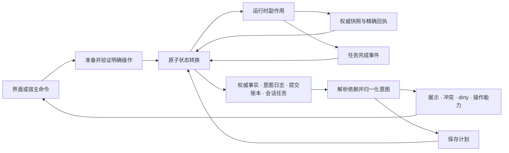

# 状态内核重构设计

状态：设计基线，生产入口已切换到 Workspace，旧内核已删除；完整验收仍在进行。设计日期：2026-09-07，状态更新：2026-09-12。允许 breaking change。实施证据与剩余工作见 [state-kernel-progress.md](state-kernel-progress.md)。

本文定义下一代内核的规范性行为与实施顺序。它替代旧草稿模型作为重构目标，**不表示当前代码已经满足这些约束**。旧实现历史见 [draft-state-model.md](draft-state-model.md)，当前保存链路见 [persistence-consistency.md](persistence-consistency.md)，逐项验收入口见 [state-kernel-acceptance.md](state-kernel-acceptance.md)。

## 1. 目标、范围和确定采用的决策

目标：对每一份已接纳的用户输入，能解释它现在由谁保存、为何阻塞、是否真正落库，以及哪些事件有权终结它。权威刷新、展示投影、历史恢复和保存回执均不能凭行数组猜测操作意图。

本次重构覆盖：文档与字段契约、行身份、草稿操作、冲突、保存、撤销/重做、编辑与批量会话、异步任务、工作区生命周期、恢复协议及 React 接口。保留 complete-scope 数据集、三种保存调度模式、选择/排序/过滤、复制/粘贴/填充和自定义类型能力。

不引入协同 CRDT、离线多设备合并、服务端分页或窗口协议。当前全部数据已加载的定位不变。多客户端通过权威版本和冲突协议协作。渲染布局与选择算法可以复用，但它们只能读取投影、发出命令。

确定采用：

1. 一个工作区对应一个固定的 scope、schema 和值编码版本。
2. 权威数据、不可变意图日志、精确提交证据、会话输入各有唯一所有者。
3. 展示行、dirty、可保存项、冲突和历史导航是派生结果；不再作为彼此重建的输入。
4. 内部 EntityId 与服务器身份分离；服务器主键回填只修改绑定。
5. 编辑在接纳时编译为完整、确定的写集合；刷新与回放不执行任意 setter。
6. 同一 scope 至多一笔未决持久化写；其间允许继续输入与撤销。
7. 客户端部分保存选择可保存子集；一次请求内所有项由服务器原子应用。
8. undo 是对一次用户操作贡献的撤销；尚未应用时抑制意图，已经应用时生成补偿。
9. Workspace 由宿主持有；React 卸载只分离视图。
10. 新生产入口切换后只保留一套状态内核，不长期维护旧状态兼容层。

## 2. 为什么需要改变数据模型

现有三个反例暴露了同一种信息丢失：

| 反例 | 行数组无法表达的信息 | 新模型的归属 |
| --- | --- | --- |
| 删除冲突中的 A 仍然显示，保存 B 后 A 的删除消失 | A 是展示出来供解决冲突，还是用户已取消删除 | 独立的 Delete 意图及其生命周期 |
| 双方后来都删除 A，本地却把冲突行识别为新增 | 保留的行只是冲突展示材料，不代表创建要求 | 存在性意图、服务器 incarnation 与满足证据 |
| setter 重放失败，第二次刷新清掉本地输入 | 当前展示值与真正的本地目标值已经不同 | 不可变 Write 意图或尚未应用的 Session 输入 |

同样的展示结果可能对应不同意图，因此 `diff(authorityRows, displayedRows)` 在信息上不足以恢复草稿。增加标志可以修正某个反例，不能让这个逆向过程普遍成立。

## 3. 单向数据流与唯一事实来源



没有“展示行 → 重建意图”这条边。计划和投影可以缓存，但缓存不拥有事实。

| 内容 | 唯一所有者 | 禁止行为 |
| --- | --- | --- |
| 最新可接纳的服务器状态 | AuthorityStore | 用旧草稿或较早回执覆盖较新的权威状态 |
| 已应用到本地草稿的用户要求 | IntentJournal | 把唯一目标值放进冲突或展示行 |
| 尚未接纳的排队输入/持久候选 | Workspace Runtime 的 IngressStore | 因尚未发布revision而把它当作不存在 |
| 未完成输入、无效原文 | SessionStore | 因刷新、失焦、排序、卸载清空 |
| 已发送内容和执行结果 | SubmissionLedger | 改写重试 payload，靠值相等猜测请求成功 |
| 异步输入和成功但受阻的结果 | TaskStore / ResourceStore | 只报错后丢掉唯一上传结果 |
| 可撤销的动作及其因果关系 | Journal 中的 Action/Application 记录 | 维护另一套 beforeRows/afterRows 状态机 |
| 可见行、校验、冲突、dirty、选择能力 | Projection | 反向写回上述事实存储 |

## 4. 身份、文档和值的基础契约

### 4.1 身份

```ts
// 所有 ID 均为不同的 branded string；此处为协议类型示意。
type ScopeIdentity = { sourceId: string; id: ScopeId; epoch: ScopeEpoch }
type ServerIdentity = { key: ServerKey; incarnation: Incarnation }
type EntityBinding =
  | { kind: 'local'; entityId: EntityId; creationIntentId: IntentId }
  | { kind: 'bound'; entityId: EntityId; server: ServerIdentity }
  | { kind: 'retired'; entityId: EntityId; server: ServerIdentity }
type FieldRef = { entityId: EntityId; fieldId: FieldId }
```

- EntityId 是一次实体生命期的内部身份，不是当前数组索引、展示行号或服务器 key。
- sourceId 是稳定的物理数据源命名空间，必须与 PersistenceSource.id 相同；多个 adapter 包装同一个后端时共享此 ID。快照、请求、回执和检查点都携带完整的 sourceId/id/epoch，不能把另一个后端中恰好相同的数据集、版本和行身份视为本工作区的证据。
- 同一服务器实体在本工作区重新出现时沿用 EntityId；已确定删除后新建的 incarnation 分配新 EntityId。
- 后端必须提供 incarnation，或明确保证 key 在 scope epoch 内永不复用；后一种模式可以由协议常量表示 incarnation，但不能给可复用key伪造此保证。客户端不能推断 ABA 身份；不满足时拒绝启用写操作。
- 客户端新行的 proposed key 与远端相同，不证明它们是同一实体。默认产生 `create-key-collision`，不能自动绑定并替换。
- 创建回执必须以 ItemId 关联 EntityId，不能靠内容相等或 key 猜测匹配。
- 创建请求未决且尚无精确回执时，完整读取中的未知 incarnation 可能是本次创建的服务器结果。此时不发布猜测的新 EntityId，也不让会话/任务绑定它；先保留读取的版本 frontier，查询操作结果，再按精确创建绑定取得并安装覆盖该 frontier 的完整快照。纯读取不能借这个过程给创建写入作确认。新增身份未明期间，无新 incarnation 的完整读取仍可按通常规则接纳。
- ColumnId 只标识显示列；FieldId 标识存储字段。改列标题、排序和视图不会改变字段身份。
- IntentId 标识不可变意图；ActionId 标识一次用户动作；ApplicationId 区分原操作与各次 redo；OperationId 标识一次冻结的服务器请求；ItemId 标识其内的行或排序项。

### 4.2 可保存文档

权威数据和已编译操作使用内核拥有的不可变 `Document`：可序列化对象、数组、字符串、布尔、null、有限数字。缺失属性用独立 `Missing` 表示，与 null 区分。所有路径比较与写入均基于规范编码。

Date、Map、自定义类、二进制和业务对象由显式版本化 codec 转换；File、AbortController、DOM、函数和对象 URL 不进入文档。UI 可继续使用业务 Row，但必须经过纯 `encode/decode`。无法无损编码的值在接纳时明确拒绝，不在重放中降级或静默丢弃。

默认数组是一个原子字段。需要元素级编辑的数组应编码为稳定元素身份的子结构并声明完整写域；不以数组下标承诺跨远端插入的合并。

编码器必须证明 round-trip、确定性和原值不变性。schema/codec 版本固定在 Workspace 与检查点中，不能热替换。

### 4.3 可编辑字段与完整写集合

```ts
type Patch =
  | { kind: 'set'; path: StoragePath; value: EncodedValue }
  | { kind: 'remove'; path: StoragePath }
type ExpectedResource = {
  resource: ResourceRef;
  expected: EncodedValue | Missing;
  anchor: Anchor;
  role: 'write-base' | 'semantic-read' | 'policy-guard';
};
type WriteGroup = {
  groupId: WriteGroupId;
  writes: readonly Patch[];
  expectations: readonly ExpectedResource[];
  before: readonly ResourceValue[];
}
```

`ExpectedResource.role` 必须区分 `write-base`（被覆盖资源的比较基值）、`semantic-read`（计算目标时真正依赖的资源值）和 `policy-guard`（权限/约束观察）。写域自身的旧值由三方比较处理，不能又笼统要求它永远等于 R。一个资源若同时被业务计算读取与写入，两种角色都必须声明。

一个操作组是最小的本地原子写域。准备器一次性解析输入、捕获 read-set、生成完整 write-set，包括 setter 过去隐式更新的隐藏字段。`before` 是可逆所需的原始资源值，不是整张表的快照。

read-set 同时保存读取的资源与当时的实际值；不能只记录路径，等到接纳时重新读取 expected。业务计算完成后若权威变化，旧计算结果仍须按最初读取值验证，不能被新的准备时间或 revision 重新授权。

首选字段绑定稳定存储路径。业务派生写使用纯 `planEdit(context, input) → Result<WriteGroup>`；回调只在命令准备时运行，之后保存它的结果。无法证明更窄依赖时使用整行 write-base/CAS；业务计算确实读取了其他字段仍需记录 semantic-read。保守整行模式以完整目标等于权威作为可满足条件，不把同一个整行旧值再当作必须恒等的隐藏前提。内核检查路径合法、重复/重叠写域和 codec，保护只读字段并验证整个候选行。

不同列可以绑定同一个 FieldId，但不能把同一写域伪装成互不相关的字段。不同组路径重叠时合成有序依赖组；无法证明可交换则以整行作为冲突域。外部 I/O 与非确定副作用不得放进 planEdit。

任意旧 `setValue(Row) → Row` 契约不再用于重放。迁移时可以把它转成**命令接纳时的一次性文档变换 + 完整文档差量 + 整行前提**，前提是纯函数、无损 codec、完整权限检查；没有这项保证就必须重写适配器。

## 5. 内核状态及原子执行

```ts
type KernelState = {
  revision: number;
  workspace: WorkspaceIdentity;
  authority: AuthorityState;
  policy: VersionedPolicySnapshot;
  schedule: SaveSchedule;
  entities: EntityRegistry;
  journal: IntentJournal;
  inputs: InputLedger;
  settlements: SettlementLedger;
  persistence: PersistenceState;
  session: Session | null;
  tasks: ReadonlyMap<TaskId, TaskState>;
  view: ViewQuery;
  interaction: InteractionState;
  lifecycle: WorkspaceLifecycle;
}

type Transition = {
  state: KernelState;
  effects: readonly EffectDescriptor[];
  result: CommandResult;
}
// 不读取网络、时钟、随机数、React 或可变宿主状态。
reduce(state: KernelState, event: KernelEvent): Transition
```

时钟、ID、策略版本和 prepared payload 由事件携带。prepare 阶段执行可能失败的 codec/业务计划；其结果同时包含本地 semantic revision、observation token 和 policyVersion，接纳前重验三者。仅检查 observation 不足以发现同一权威快照下发生的后续本地编辑。过期时原输入仍归会话或命令资源仓库，不自动按新的权威值重新批准写入。

同一个 transition 内原子提交 journal、会话所有权转移、任务消费和 effect outbox。先发布完整状态，再执行副作用；同步完成也必须重新排队为事件。失败不发布部分状态，不发送部分请求。

策略也必须是事件输入：以 `PolicyObserved(version, capabilities)` 更新已拥有的只读策略快照，不能让 reducer 读取宿主可变闭包。schema 校验器和比较器是固定版本的纯函数。网络、clock、随机数、资源句柄均在 Runtime；确定性调度 token 在 SaveSchedule，迟到定时事件必须核对 token。

保持现有 Runtime 的原子发布思想。重入公开命令返回结构化 busy；内部事件按顺序排队。内核输入路径统一，不允许 Escape、按钮和 API 各自直接写 `session = null`。

### 5.1 AuthorityState 与加载/失败

```ts
type AuthorityState = {
  content:
    | { kind: 'uninitialized' }
    | { kind: 'complete'; observation: ObservationId; version: AuthorityVersion;
        entities: ReadonlyMap<EntityId, AuthorityEntity>; order: readonly EntityId[] };
  read: { kind: 'idle' } | { kind: 'loading'; ticket: ReadTicket }
      | { kind: 'failed'; issue: Issue; ticket: ReadTicket };
}
```

未初始化不等于空表；只有已接纳 complete 空快照才显示“没有记录”。首次完整权威到达前不接受普通数据写操作；外部导入输入可由独立任务/恢复区保留，但必须等待身份与权限可验证后应用。后台刷新失败保留上一份完整 authority 与本地意图，提供重试状态。

ObservationId 对应不可变的数据证据，更新 read 状态不产生伪数据版本。完整快照缺少实体才能证明它不存在；错误或未加载状态绝不能提供删除证明。

### 5.2 不变量由哪些转换维护

内核永远先验证 scope/schema、ID和引用、资源拥有关系、提交reservation及因果依赖无环，再接纳候选。规范化可以返回“建议结算的权威满足证明”，但只有对应事实事件的 reducer 有权写 SettlementLedger；getProjection/getSavePlan 无写入权。

业务拒绝是结构化结果，包含 InputRef/ActionId、原因和恢复命令。已经接纳的 Task/Session 输入不因命令失败释放；尚未接纳的宿主程序化输入在拒绝交付前由 ingress 持有，再明确归还调用者。错误 presenter 不拥有输入，也不能通过 dismiss 错误丢弃它。

## 6. 意图日志：长期保存语义，不保存展示快照

### 6.1 记录结构

```ts
type IntentRecord = {
  id: IntentId;
  actionId: ActionId;
  applicationId: ApplicationId;
  sequence: number;                 // 仅本地因果顺序，不能证明服务器新旧
  cause: 'user' | 'task' | 'undo' | 'redo' | 'resolution';
  inputs: readonly InputRef[];
  dependencies: readonly IntentId[];
  operation: IntentOperation;
}

type IntentOperation =
  | { kind: 'create'; entityId: EntityId; document: Document; proposedKey?: ServerKey }
  | { kind: 'write'; entityId: EntityId; groups: readonly WriteGroup[] }
  | { kind: 'replace'; entityId: EntityId; expected: Anchor; document: Document }
  | { kind: 'delete'; entityId: EntityId; expected: Anchor; recoveryDocument: Document }
  | { kind: 'order'; expected: Anchor; desired: readonly EntityId[] }
  | { kind: 'undo'; targetApplication: ApplicationId; frontier: FrontierRef }
  | { kind: 'redo'; targetAction: ActionId; frontier: FrontierRef }
  | { kind: 'resolve'; decision: ResolutionDecision }
  | { kind: 'discard'; targets: readonly IntentId[]; scope: DiscardScope };
```

其中业务写 payload 一旦接纳便不可变。undo/redo/resolve/discard 是语义控制记录，由同一 normalizer 解释，不是任意回调，也不能改写已发送记录。

Journal 包含动作的用户标签、目标、原文/资源引用以及可逆材料。History 是它的索引：动作顺序、当前 application、已撤销关系、redo 分支。不得另存可以独立演化的行快照。

SettlementLedger 保存每个被覆盖意图的终结证据：本工作区精确提交覆盖、明确撤销/丢弃、未提交操作被权威满足、或被后继操作吸收。证据引用不可变事实；这是不同于业务 payload 的生命周期信息。不能仅以布尔 dirty 代替它。

### 6.2 前提锚点

```ts
type Anchor =
  | { kind: 'authority'; observation: ObservationId; resources: readonly ResourceValue[] }
  | { kind: 'logical-output'; predecessor: FrontierRef; fallback: AuthorityAnchor }
  | {
      kind: 'submission-output'; operationId: OperationId; itemId: ItemId;
      frontier: FrontierRef; fallback: LogicalOutputAnchor;
    };
```

锚点描述“用户决定修改时，基于什么”。本地修改之后的另一次修改引用前序逻辑输出；保存期间的后继操作引用提交项的输出边界，并保留未应用时的逻辑 fallback。

submission-output 只能解析 write-base，不能把 semantic-read 自动改成 canonical。例提交 qty=2 被规范化为3，其间用户基于 qty=2 计算 total=20：保留 total20 和原输入，标记计算依赖变化，需要用户重新应用；不能把 qty 前提改成3后批准 total20。直接手输 qty=4 则可以用 canonical3 作为写入基值。policy-guard 按最新策略验证，但不能改变用户目标。

锚点与当前服务器状态不同不等于用户同意覆盖。只有明确的冲突解决可以建立新的期望前提。刷新不能把本地旧前提静默改成最新远端值。

### 6.3 归一化与依赖

Normalizer 输入只有 authority、journal、settlements、receipt 和 schema；输出 `EffectiveIntentSet`，包含最终目标、原始前提、精确 coverage、依赖及阻塞原因。

1. 解析控制记录与 settlement，确定仍有贡献的操作及当前 action application。
2. 按 EntityId、原子写域、read/write 依赖建立有向无环的本地因果链。
3. 合并未跨越未决提交边界的操作，保留原始前提、最终目标和全部 provenance。
4. 对每个域执行三方比较和权限/约束检查，生成可展示与可提交的不同投影。
5. 验证终结规则；记录满足证据必须由显式 transition 完成，纯 selector 不修改 journal。

常用归一规则：

| 输入链 | 可归一的含义 | 保留的信息 |
| --- | --- | --- |
| x:0→1→2，均未提交 | expected 0，desired 2 | 两次 action 的原值及 coverage，供逐次 undo |
| 创建→编辑，均未提交 | 一次创建最终文档 | 创建身份、编辑原文、各 action |
| 创建→删除，均未提交且无依赖 | 无服务器写入 | 由用户取消新增的证据、可 redo 的材料 |
| 字段编辑→删除已有行 | 删除该 incarnation | 恢复前的本地文档和字段历史；删除前提取相应权威观察 |
| 未提交操作→undo 同一操作 | 抑制其贡献 | authority 不被逆向覆盖 |
| 已提交或未知的操作→undo | 等待结果或补偿 | 原请求和对应输出锚点 |
| 同一字段不同意图跨未决提交 | 不合并请求 | 后继保留提交依赖，不能提前发送 |

归一不是数据丢弃。被吸收节点只可在历史、任务、提交、检查点均不再引用时压缩。所有活跃输入必须有可追踪归宿。

本地净效果为零也不是每个中间动作的终态。`create→delete` 和 `0→1→0` 应形成可逆的 neutral 前缀：无需网络写入，原输入继续由 journal 拥有；undo 最后一步分别恢复新增要求和目标1。normalizer 以捕获的原始写域和已确认的 canonical 前提证明净效果，不以最新 authority 值猜测。后续刷新或新动作不能复活已抵消的前缀，历史导航则可以改变它。保存结果、dirty 与关闭 blockers 必须区分 neutral 历史、有效待写贡献和未决请求；checkpoint 仍保存 neutral 的恢复材料。

neutral 可以消除最终写入，不能消除已被其他输入读取的中间表达式。例 `A0→1，B读取A1写1，A→0`，A无需提交，B仍可根据自己捕获的因果前缀验证；若当前远端A3不满足该前缀的base0或target1，则B阻塞，A仍显示3。新输入在A抵消之后读取的则是当前authority，不重新依赖旧前缀。排序和字段采用同样规则，不能因某个域净效果为零就改变另一个域的计算语义。

实现中的历史读取投影只评估严格早于消费者的前缀，使用当前authority及精确提交事实，单次投影共享缓存；它不能发布、提交或结算任何历史前缀。最终文档schema只校验完整提交候选，不能把中间组装状态当作独立提交文档。读取链的比较前提、语义依赖和权限仍需验证。

## 7. 合并、冲突与显示

### 7.1 字段组三方规则

对原子域，B 为解析后的预期资源值，L 为意图目标，R 为当前权威值：

| 条件 | 结果 |
| --- | --- |
| R 与 B 相同，依赖仍成立 | 可把 L 投影到当前文档；其余远端字段保留 |
| R 与 L 相同，独立 semantic-read/约束仍成立 | 未提交意图可标记为权威已满足；未决请求必须等待提交结果 |
| R 与 B/L 均不同 | 保留 L 和 B，产生冲突；不进入保存 coverage |
| 写路径已不存在、codec/约束失败 | 保留 payload，显示 materialization-blocked；不执行任意 setter 重试 |
| 只读字段或权限变化 | 保留意图，产生 policy-blocked；不得用本地修改后的行证明有权限 |

多字段 WriteGroup 整体判断，不能只满足一半。独立 semantic-read 字段改变，即使写目标相等，也必须重新验证或明确重应用。只有 write-base 的旧值被自己目标覆盖不是阻塞理由，否则普通 x0→1 遇到 remote1 永远不能收敛。全行替换与删除用完整文档/行版本前提，包含隐藏字段。

冲突是上述比较的诊断投影，至少包含 IntentIds、EntityId、域、base/local/remote 和原因。它可以重复生成；用户输入仍在 journal。ConflictId 基于相关 intent/frontier 和远端观察生成，解决命令必须携带此 ID，防止处理过时冲突。

### 7.2 存在性与身份转换

| 本地要求 | 新的权威状态 | 必须行为 |
| --- | --- | --- |
| delete E | 同 incarnation 存在且未变 | 保持删除，正常可保存 |
| delete E | 同 incarnation 内容变化 | 删除冲突；可显示 R，但仍是 delete |
| delete E | E 已不存在 | 未提交删除满足并退场；未决删除等待 receipt。禁止生成 create |
| write/replace E | E 已不存在 | 保留完整输入，目标已删除；不能自动转 create |
| create L | proposedKey 无占用 | 正常创建 |
| create L | 同 key 的远端 E 存在 | 创建冲突，L 与 E 仍是不同身份 |
| 旧 E 被删除 | 同 key、新 incarnation E2 出现 | 旧意图仍指 E，不作用于 E2 |

“被远端删除后恢复为新行”是明确的 `recreate` 决策：分配新 EntityId，将完整恢复材料编译成新的 create，重新检查 create/replace 权限。不能只改结构标记。

### 7.3 冲突解决命令

- `use-authority`：明确丢弃所选意图贡献，保留其他行/域；历史能恢复该选择所丢弃的输入。
- `keep-local`：用户认可当前远端观察并要求保留原 payload，追加带新前提的决策；再次变化必须重新冲突。
- `merge`：接纳用户提供的新 WriteGroup，包含最新观察和完整目标；原输入作为历史材料保留。
- `recreate`：目标已删除时新建实体；需明确授权，不自动发生。
- `adopt-existing`：创建 key 冲突时，显式选择现有 EntityId 作为目标，原 create 被抑制，产生新的 write/replace；全量验证只读及隐藏字段，并记录身份转移，禁止暗中合并两份身份。

对已发送或结果未知的意图，解决/丢弃只能影响其后继意图；不能改变请求，也不能声称撤销了服务器执行。

决策请求绑定用户实际审阅的semantic revision、observation及该域完整issue IDs；任何变化后都要重新审阅，不能在点击处理时偷偷改用最新观察。默认处理当前行/排序域的全部有效贡献，也可以明确指定该域中的后继IntentIds；包含reservation的目标一律拒绝。接纳时重新编译并比较完整决策，把旧贡献的discard证据、控制记录、新应用和新输入身份一起发布。新保存coverage只覆盖新贡献，不覆盖已经撤回的旧要求。

keep-local仅重建写入比较前提，保留原semantic-read和policy-guard；计算前提变化需要明确merge或重新计算。order的merge必须提供包含当前全部成员的完整顺序。recreate为已删除目标分配新EntityId，验证create及原目标replace权限；adopt-existing要求确实存在创建冲突，明确选择当前绑定的目标和完整文档，并校验只读、隐藏字段及schema。

路径写入之外，动作保留受影响实体在开始时的完整逻辑恢复文档和观察版本。它是恢复材料，不是自动覆盖权限。源实体被删除后，恢复规划以该材料及有版本依据的较新exact canonical文档为基底，再应用原始意图；无法证明更完整材料或版本可比时不能猜测整行。

撤销冲突决策有两个明确结果：数据替换部分使用一般条件undo（未应用时抑制，已应用时补偿）；被决策撤回的输入以新的InputRef恢复到独立RecoveryEntry，保留原IntentIds作为模板依据。恢复条目用于继续编辑/显式重应用，不会自动把旧值拼回当前数据。旧discard/commit证据永不撤回。redo重新执行存储的数据模板，并在成功接纳同一转换时显式discard对应恢复条目的输入；若新权限或读取前提使redo失败，恢复归宿不变。

### 7.4 展示契约

```ts
type RowProjection = {
  entityId: EntityId;
  authority: Document | null;
  preview: Document | null;
  retainedInputs: readonly InputProjection[];
  existence: 'present' | 'local-create' | 'pending-delete' | 'remote-deleted';
  issues: readonly ProjectedIssue[];
  persistence: 'clean' | 'pending' | 'submitted' | 'blocked';
}
```

展示可以显示待删除行来解决冲突，也可以隐藏普通待删除行；两者不改变 delete 意图。preview 无法构造时展示权威值并提供明确的本地输入恢复区域；不能用权威值覆盖输入。dirty、计数、保存按钮和关闭 blockers 统一从有效意图及会话任务投影产生。

## 8. 保存计划、回执与权威顺序

### 8.1 保存计划与冻结

```ts
type FrozenSubmission = {
  workspaceId: WorkspaceId;
  operationId: OperationId;
  scope: ScopeIdentity;
  schemaVersion: SchemaVersion;
  payloadHash: string;
  baseAuthority: AuthorityVersion;
  items: readonly FrozenMutationItem[];
  coverage: ReadonlyMap<ItemId, readonly IntentId[]>;
  frontier: FrontierRef;
}
```

保存计划由有效意图生成，默认以整行作为保存单元；该行任一冲突、校验或权限问题阻止整行。不同可保存行可组成同一次请求。

一个本地事务总是原子接纳；持久化原子域另由 `saveAtomicity: 'row' | 'transaction'` 声明，默认 row。transaction 模式的跨行依赖闭包任一受阻则整组受阻。本地 undo 分组不能被误认为服务端原子性。

规划步骤：验证当前权威和 policy token → 归一化 → 选择可保存组 → 求未确认前驱及结构/排序依赖闭包 → 编译确定请求 → 同一 transition 冻结 coverage 和请求 → Runtime 完成适用的持久化屏障 → 发出网络 effect。具体屏障见第12节。

冻结后请求、hash、OperationId、coverage 永不变化。保存 B 的 coverage 不含 A，任何回执处理都不能清理 A。被覆盖的中间操作表示其组合效果被最终值吸收，不证明每个中间值在服务器执行过。

三种保存模式只决定何时请求规划，不各自拥有提交语义。没有可保存项时返回结构化 blockers，不假报保存成功；任务/会话尚未应用不算已保存。

### 8.2 提交状态机

```ts
type PersistenceState =
  | { kind: 'idle' }
  | { kind: 'waiting-for-gateway'; ticket: SaveTicket; requestedFrontier: FrontierRef }
  | { kind: 'sending'; submission: FrozenSubmission; attempt: number } // 只有提交过持久屏障的outbox可以运行
  | { kind: 'outcome-unknown'; submission: FrozenSubmission; issue: Issue }
  | { kind: 'committed-awaiting-receipt'; submission: FrozenSubmission; proof: CommitProof }
  | { kind: 'committed-awaiting-authority'; submission: FrozenSubmission; receipt: ExactReceipt; requiredFrontier: AuthorityFrontier }
  | { kind: 'receipt-blocked'; submission: FrozenSubmission; receipt: ExactReceipt; issue: Issue };
```

| 事件 | 处理 |
| --- | --- |
| 写超时、断网、普通异常 | outcome-unknown，保留冻结请求；超时不证明未写入 |
| 可信 not-applied | 解除这次 reservation，原意图恢复 eligible；下一次请求使用新 OperationId |
| 同 ID 重试 | 同 hash、同 payload、同 coverage；只增加传输 attempt |
| 确认已应用但拿不到精确结果 | committed-awaiting-receipt；只查询结果，不重发 mutation |
| 收到合法 exact receipt | 落账本次写已应用，进入 committed-awaiting-authority；先保留 submitted 展示贡献，不提前清除 coverage |
| 同时覆盖当前authority frontier和committedVersion的完整快照已可接纳 | 同一 transition 更新 authority、结算精确 coverage、解析后继锚点并解除屏障 |
| receipt 不完整、身份冲突或本地处理失败 | receipt-blocked，保留原请求及回执；重试本地协调/查询，禁止重发已应用写 |
| 重复回执 | 相同事实幂等；同 ID 不同结果为协议错误，隔离并阻塞 |

等待共享 gateway 时只有保存 ticket，尚未冻结网络请求；获得排他发送资格后重新检查权威、策略和当前有效意图，再冻结。这一时刻决定本次实际 coverage；保存并关闭只能依据实际 coverage 与新 blockers 判断完成。调度/等待本身不能被显示成已写入。

同一 scope 的未决写由共享 gateway 串行管理，即便存在多个 Workspace。每个 Workspace 的 journal 独立，不允许第二个工作区绕过网关并发发送不受跟踪的同 scope 写。

gateway 以物理 sourceId 共享注册表，许可绑定完整 scope、WorkspaceId 和不可伪造的运行时身份。冻结请求含 workspaceId，SHA-256 覆盖除摘要本身以外的整个协议 payload（包括身份、coverage 和 frontier）；异步计算摘要结束后再次验证许可仍归当前执行者。当前内存 gateway 的排他范围是同一个 JavaScript realm；跨 tab/进程恢复的单活执行器还需要第12节的 RecoveryStore lease，不能由此注册表代替。

持久Workspace的gateway holder还绑定lease epoch与活跃性；获取许可、等待摘要后和
实际调用source前均校验。恢复实例可以接管同Workspace已fence的holder，但必须由
恢复state中的原submission或完整commit/rejection事实证明该请求归属。接管保留原
in-flight job、terminal evidence和authority frontier；原网络请求已经发送时可以继续
取得结果，旧Runtime无权再次发布，新Runtime协调同一个OperationId。缺失恢复证据
不能解除旧许可，也不能让新的不同请求跳过它。

### 8.3 精确回执契约

```ts
type ExactReceipt = {
  operationId: OperationId;
  payloadHash: string;
  scope: ScopeIdentity;
  committedVersion: AuthorityVersion;
  results: readonly (
    | { itemId: ItemId; kind: 'created'; binding: ServerIdentity; canonical: Document }
    | { itemId: ItemId; kind: 'updated'; identity: ServerIdentity; canonical: Document }
    | { itemId: ItemId; kind: 'deleted'; identity: ServerIdentity }
    | { itemId: ItemId; kind: 'ordered'; canonicalOrder: readonly ServerIdentity[] }
  )[];
}
```

服务器在同一原子边界保存 operation ID、payload hash、实际变更及可恢复的 exact receipt。重复相同请求返回同一事实，同 ID 不同 payload 拒绝。receipt 必须与请求项一一对应，身份和顺序合法；canonical 文档包含本次写产生的规范化/隐藏字段。

结果 envelope 按 ItemId 识别；外层结果数组的返回顺序不改变事实。只有 ordered 项内的 canonicalOrder 具有顺序语义。同一 operation 的真正不同结果须隔离并阻止后续写，不覆盖已记录的精确事实。若完整权威快照声称处于 exact committedVersion，其对应项目必须与 canonical 输出一致；更新的版本则允许出现后续远端写。

等价的“本次 commit version 的完整精确快照”也可接入，但不能把之后任意一次读取作为精确写结果。服务端触发器若影响请求外的实体，必须通过同一版本的完整快照或完整 effect envelope 报告；增量结果不能冒充完整权威快照。

为降低实现复杂度，首版网关在接纳完整 receipt 后，取得同时覆盖当前已接纳 authority frontier 与 committedVersion 的 complete-scope 权威快照，再解除依赖保存屏障。若当前 authority 已有这一证明，可在 receipt 事件内直接完成同一原子转换。

**写已应用与从本地覆盖层退场是两个不同事实。** committed-awaiting-authority 期间 receipt 已落账，submitted 意图仍维持此前可见贡献，后继输入继续投影；UI 显示已写入、等待同步。不能因 coverage 已知应用便将显示回退到旧 authority。取得完整快照后才原子执行 authority 更新、coverage 结算及后继解析；刷新失败保留此状态，不重发写。此阶段 undo 已知道原写 applied，可以接纳条件补偿，但补偿发送仍等屏障解除。

`lookupOperation(id, hash)` 返回 pending / applied(exact receipt) / rejected-not-applied / unknown。404、幂等记录过期和服务不可用不能伪装成 rejected。精确结果的可恢复窗口必须不超过后端声明的 receipt 保留期。

结果保留期与防重复执行是两项独立保证。可写 source 还必须声明 `operationIdFence: 'scope-epoch'`：同一 OperationId 在原 scope epoch 中永不成为另一份新写。receipt 可以过期，但需保留执行 tombstone，或通过后端 epoch/有效期围栏确定拒绝过期重发；不能删除幂等记录后把相同请求当作首次执行。客户端超时、404 和本地时钟均不能替代此保证。缺少该后端契约时拒绝启用新协议的写入口。

### 8.4 精确提交边界与最新权威必须分开

例：x=0 → 本地提交 1 → 保存中输入 2；服务器把 1 规范化为 1.5，另一用户随后改成 3。

- 精确 receipt 把后继输入的 base 解析为 1.5。
- 最新 authority 是 3，保留 local 2，产生 base=1.5/local=2/remote=3 冲突。
- 普通刷新读到 3，不能据此认为本次写把 1 规范化为 3，也不能自动覆盖为 2。

若本次请求明确 not-applied：后继 anchor 回退到前序逻辑输出，归一化仍是 original base 0 → desired 2。latest=3 时仍冲突；不能静默改成 base3→2。

### 8.5 权威新旧证明

首选适配器提供 scope 内可比较的服务器 revision，连同不复用的 scope epoch。收到较早快照不覆盖较新快照；同 revision 不同文档视为协议错误。

只提供 opaque ETag 的后端必须接入串行、满足 read-at-least(frontier) 的因果读取 gateway：读取具有服务端可信的写屏障和单调读保证；无法排序的推送只触发重新读取。适配器本地请求序号只防迟到回调，不能证明缓存中的数据较新。

exact receipt 可先于或晚于较新的 authority 到达。账本接纳提交事实不等于回退可见 authority。普通 refresh 不能解决 unknown outcome，也不能替代缺失的精确提交结果。

### 8.6 原子保存的服务器责任

服务器验证 scope/epoch、预期版本或 read-set CAS、实体 incarnation、完整字段及行权限、数据约束和依赖闭包，随后原子写入全部 items 并记录 receipt。浏览器检查用于反馈，不能替代这些检查。

新协议不支持请求内静默部分成功。需要非原子后台时必须显式实现每项 receipt、依赖失败和子项幂等的新协议；不能返回模糊 success。

## 9. Undo / redo 的完整语义

### 9.1 动作、应用和导航

一次用户动作包含一组明确的资源变更、原始资源值和恢复材料。其第一次执行与每次 redo 都有独立 ApplicationId 和新 IntentIds，引用同一动作模板。模板不含重执行业务 callback 的函数。

History 只索引 journal。新用户动作在 undo 后创建新分支，旧 redo 分支退出导航，但仍被提交/恢复依赖的事实不得删除。远端刷新不改历史内容；只改变当前 undo/redo 的能力和潜在冲突。

### 9.2 不同落实状态下的撤销

| 被撤销的贡献 | undo 的含义 |
| --- | --- |
| 未提交 | 抑制该贡献，恢复此前有效的本地意图；没有此前意图时显示当前 authority |
| 已被其他本地操作吸收 | 沿 provenance 撤销该 action 的贡献，不虚构中间服务器状态 |
| 正在提交/结果未知 | 保存条件化 undo；原请求继续持有，结果明确前不发送补偿 |
| 明确 not-applied | 撤销仍 pending 的贡献，净效果可以归零；不补写旧权威值 |
| 本工作区精确 applied | 追加补偿意图，以当前本地因果前沿及实际 canonical 输出为前提，恢复动作之前的资源目标 |
| 未提交但被远端相同值满足 | 仅撤销本地要求，不冒充撤销别人的服务器写；可能没有可见值变化 |

base0→提交1→undo：成功则以实际规范化输出为 base 补偿到0；未应用则抑制原意图，若 latest3 应显示3。它与用户明确手输0不同，必须保留 undo 语义直到落实状态明确。

控制记录按行和显式 order 域拥有独立 IntentId，引用目标 application 与该域完整目标贡献，保存接纳时编译的逆操作材料和因果前沿。结果未知时只归一化其候选展示；原 reservation 继续阻止发送。明确未应用后，原贡献取得 discarded 证据、控制取得 control-completed 证据；这只证明本地要求已撤回，不证明服务器执行过补偿。实际 applied 后，网络 coverage 使用控制自身的 IntentId，不能再次结算原请求的 coverage。

base0→1(t1)→2(t2) 合并保存2：receipt 只证明最终2。undo t2 目标1、前提为实际 canonical2；再 undo t1 目标0、前提为前一次补偿的逻辑输出1。不能假设服务器曾规范化 t1 的1。

若远端在已保存值之后改成3，undo 的补偿与3比较，产生冲突，不能直接恢复整行旧快照覆盖别人字段。

### 9.3 结构操作

- 未提交 create 的 undo 抑制 create 及其需要撤销的动作贡献；存在后继依赖必须按栈顺序撤销或明确整个依赖闭包。
- 已提交 create 的 undo 是删除所创建的那个 incarnation；编辑期间主键回填不改变目标。
- 已提交 delete 的 undo 需要源明确声明 `restoreDeleted` 能力：可用完整恢复文档创建新实体，或提供服务端 restore token。恢复创建分配新 EntityId，通过 `restoresEntity` 记录历史关系；不能自动继承旧实体的延迟任务或写入。只读/服务器生成字段如何重建由该能力声明并验证。没有恢复能力时，该删除保存后不可撤销，UI 必须在删除和保存前显示这项限制，不能伪造通用 create。首版只接受产生新 incarnation 的恢复协议；同 incarnation 的服务端反删除超出本次契约，不能当作普通创建。
- redo 已落库的删除恢复/创建时，依据当前 action application 的实体绑定分配或定位正确的新实体，使用新请求 ID；不复用已失效身份。
- redo 的字段目标来自动作模板；当前因果前沿提供比较前提。权限与约束仍按最新 authority 检查。
- 一个动作部分行已保存：undo 对已应用部分生成补偿，对未提交部分抑制；本地接纳为一个原子控制动作，网络仍按明确的 saveAtomicity 执行。

恢复后允许继续撤销更早的动作，但只有**新生成的补偿**能沿显式 restoration lineage 定位当前恢复实体。例 E1.x0→1 已保存、删除 E1 已保存、undo删除创建E2.x1，再undo字段动作，应生成针对E2的 x1→0；原 E1 意图、任务、receipt 永不重绑。lineage 中若当前实体被别人删除/替换则阻塞并要求明确处理。每次恢复的新 EntityId 在 Undo 接纳事件中预分配并持久保存（或由该控制记录ID确定派生），normalizer 不产生随机ID。

当前恢复能力采用明确的完整文档协议：source 声明能从保留的完整删除文档重建实体，包括处理只读/服务器生成字段；不具备此保证则声明不支持。恢复请求包含原删除的 OperationId、ItemId 和 ServerIdentity，后端验证精确删除证明并创建新 incarnation。恢复材料取冻结删除项的实际 before，不能丢掉先前请求晚到的规范化字段。删除结果未知时保留条件恢复，新历史命令等待删除结果明确后再跟随其 lineage；恢复权限变化仍会阻止发送。

当该删除项同时吸收此前尚未保存的应用时，actual before 只是恢复基底，不能冒充动作前的完整逻辑目标。恢复规划从该项的精确 coverage 中找出目标动作开始前的贡献，按原始顺序应用到 before；当前被撤销动作内部的 write/replace 不重放。例如 `x0→动作A写1→动作B写2并删除` 合并为一次删除，撤销B应恢复1，而非物理删除前的0或B内部的2。已经单独提交的A不在该删除项 coverage 内，必须保留 actual before 中A的规范化结果。

逆操作引用资源域，避免撤销一个字段时恢复整个旧文档。逆操作保留原 write-base 的完整比较范围；字段写若声明整实体比较，撤销也不能降为路径比较。整行替换的 undo 才可能恢复完整替换前文档，并按整行冲突及权限规则处理；write/replace 混合动作从首次替换前的完整材料反向还原更早写入，再以整个动作结束的逻辑输出作为条件。

redo 不复用原 IntentId，也不能把原 application 的 settled 状态改回 pending。新 application 指向同一 ActionId 模板，以当前写入前提重新接纳已存储的操作 payload，保留原业务计算的 semantic-read 值与显式依赖；原依赖位于同一个重做动作内时，引用对应的新贡献。不得通过压成一份最终文档丢弃动作内部的读取、写域、身份变化或依赖顺序。

重做编译单位是原始 IntentRecord，而非按行合并的最终结果。每个新控制保存 sourceIntentId，按原 sequence 编译 write/create/replace/delete/order；动作内部依赖映射到对应的新控制。原始创建统一分配新 EntityId，后续针对它的修改、排序和实体资源读取使用同一新身份。历史接纳重新编译并比较整份结果，不能通过篡改单个 replay payload 绕开模板。

## 10. 持久顺序、查询和选择

- ViewQuery 的过滤、排序是展示状态；不进入持久化数据意图，不改变用户批量目标。

ViewQuery持有单调version、按ColumnId标识的筛选表达式和按FieldId绑定的显示排序。
首版表达式为equals/contains/less-than/greater-than、missing、all/any/not；输入解析器
在应用请求时编译表达式，内核只接纳可序列化表达式和编码值，不保存业务回调或预先过滤的
行快照。equals使用编码值相等；contains为区分大小写的字符串包含；大小比较只接受相同
类型的数值或字符串，不隐式转换。missing与null保持独立。

显示排序有确定的类型顺序：missing、null、boolean、number、string、复合编码值；
字符串使用确定的码元顺序，同键保留持久行顺序。显示查询只产生visible rows，完整
数据投影和保存规划不经过此筛选。查询版本保留为InputLedger的applied-to-view证据，
后续修改查询不能改写已应用版本，也不进入数据undo栈。
- 持久顺序是独立 order 域，记录 authority 顺序前提及期望 EntityId 序列，不从当前排序后的界面反推。
- create/delete 默认执行追加/移除语义；显式插入位置或拖动持久顺序产生 order 意图。
- order 保存必须与其依赖的创建/删除组成同一闭包；被引用实体既未绑定、也不在本次创建闭包内，或相关意图被阻塞/提交未决时，order 组阻塞，其他独立字段组仍可保存。
- 请求中的实体引用允许 `bound(ServerIdentity)` 或 `createdInThisSubmission(ItemId)`，服务器在同一事务中解析创建后的身份并应用 order；因此插入到中间可以一次原子完成。canonicalOrder 回执只返回最终 ServerIdentity。
- 首版使用保守的整序列 CAS：远端顺序等于 base 时应用 desired，等于 desired 时满足；其他远端新增、删除或移动均产生 order conflict。与本地同批 create/delete 的变化由同一依赖闭包先计算期望存在集合，属于本地语义，不当作外部冲突。
- order 意图同时捕获编辑时的逻辑顺序与原始权威顺序基线：前者用于完整成员校验和历史材料，后者用于整序列 CAS。结构/顺序前驱的已确认结果可以推进基线；后继排序必须使用 exact canonicalOrder，不能从后来任意一次读取借基值。创建/删除与排序的保存依赖是双向的：排序受阻时不得偷偷改为默认追加或移除，但不相关的字段仍可独立保存。
- 含显式 order 的动作另外保留开始前的完整逻辑顺序 beforeOrder。撤销创建/删除加排序时，目标来自整个动作的 beforeOrder，而非第一条 order 前已经改变过成员集合的 expectedOrder；恢复删除产生的新实体必须显式映射到该顺序。排序逆操作沿精确 canonicalOrder 比较；被别人满足或从未执行的本地 order 只撤回要求，不补写旧顺序。
- 所有动作还捕获原始权威顺序及当时未结算的结构/排序前沿。单独删除的恢复也必须还原位置：生成依赖条件恢复控制的order要求，不能把默认追加当作完整undo。原动作部分删除已应用、另一部分未知或明确拒绝时，顺序按各恢复控制的实际分支映射新旧身份；只有实际恢复的实体进入创建闭包。远端独立重排会阻塞位置恢复与创建，必须由明确冲突决策处理。没有实际本地删除应用时只撤回要求，不恢复旧顺序。
- semantic-read观察它所在意图执行前的逻辑顺序，包括此前的创建、删除与排序；policy-guard观察原始authority顺序。后继order规范化不能改写已存读取值。重做时，order读取值中的实体引用与创建/恢复使用同一显式身份映射。
- 用户解决 order conflict 时必须重新确认包含当前全部实体的目标顺序，或放弃本地排序。过滤视图中排序命令先按未显示行保留原位的明确规则编译成完整 desired；其后不再重跑规则。首版不做自动合并远端新行槽位、不引入 CRDT，避免插入锚点消失时暗中决定位置。
- 仅在本地 order 与权威明确相同且无未决相关请求时允许满足退场。保存后 canonicalOrder 是新的比较边界。
- 一个权威事件可以同时证明删除与依赖排序满足；transition 在发布前求结算闭包，每一步只能增加已验证的唯一贡献证明，直到没有新证明。无需等待另一轮刷新才能终结同一份批量输入。
- 行的目标恰好等于authority并不单独构成满足证明。必须先完成行、排序及事务的完整依赖检查，再发布允许结算的贡献；被排序依赖阻塞的计算输入仍保留原归宿。
- 选择与焦点只引用 EntityId/ColumnId；主键回填不重写选择。实体不可见时按统一交互策略调整选择，但不删除会话/意图。

## 11. 会话、异步任务和输入所有权

### 11.1 会话

```ts
type Session = {
  id: SessionId;
  kind: 'cell' | 'bulk' | 'filter';
  inputId: InputId;
  inputVersion: number;
  target: FieldRef | readonly FieldRef[] | QueryTarget;
  observation: DependencySet;
  rawInput: OwnedInput;
  phase: 'editing' | 'preparing' | 'blocked';
  composition: 'idle' | 'composing';
  issues: readonly Issue[];
}
```

首版每 Workspace 同时一个交互输入会话，以 union 消除多会话相互覆盖。背景 Task 可以多个，但都有明确 owner。

InputLedger 以 InputRef=(InputId, inputVersion) 记录接纳和归宿：owned-by-session / owned-by-task / owned-by-intent / applied-to-view / covered-by-commit / externally-satisfied / superseded-by / explicitly-discarded。多个引用共享不可变输入资源，但只有一个当前语义接管位置；从 Task 向 Session/Intent 转交与 Task consumed 必须原子发生。filter 应用的终点是版本化 ViewQuery；不能把它误报成数据丢失。资源仅在全部当前及历史引用解除后释放。

RecoveryEntry同样是明确输入归宿，状态为available/consumed/discarded；条目引用产生它的历史控制、原决策、原意图模板和恢复后的InputRefs。转交Session/Intent必须与条目consumed原子发生。读取条目、撤销数据补偿完成或view detach都不会自动消费其输入。

一个RecoveryEntry可能包含多份原文。恢复到会话时，全部原始InputRefs进入会话的
retainedInputs，同时为当前编辑文本创建新的InputRef；编辑当前文本不会替换这些原始材料。
应用时完整输入束一起交给journal，缺项或伪造原文则整个转换拒绝。明确取消会话时，
当前输入及retainedInputs记录cancelled-session终态；此前的superseded链和原始提交/丢弃
证明仍保留。consumed表示条目已转交，不表示数据已保存。

批量操作可把同一份 InputRef 展开为多个 IntentId，因此 intent 所有权记录的是完整贡献集合，不能只指定第一行。部分保存/满足时，每个意图分别记录证明，输入仍归该意图集合管理；所有贡献均有终结证据后才转为 settled-intents，保留完整证明向量。向量允许同一批量动作包含不同提交项、不同权威观察或明确丢弃，不能用第一条回执代表整份输入完成。

多个 view 共享数据时，每个会话只有一个 EditorLease(viewId, sessionId, generation)。输入/IME事件携带 lease 与预期 inputVersion；旧 view 的迟到事件拒绝。detach 释放编辑/IME lease 并保留最后接纳的 rawInput，remount 可重新取得 lease；不能留一个无人能解除的 composing 状态。原生事件处理器在 detach 前提交可取得的最后 composition 文本；未被浏览器交付的输入不在已接纳保证内。

SessionId在工作区内不复用，editor generation在每次取得lease时单调增加。会话打开绑定
已审阅revision，并捕获固定目标字段和显式读取资源的逻辑值；后续刷新按这些依赖值及当前
权限检查，不按全局revision变化自动结束会话。相关值变化后需要显式确认当前revision，
确认不能解除目标删除或权限阻塞。最终PreparedAction仍须通过当前revision的完整接纳检查；
过期准备保留会话输入，重新准备后才能应用。

- `SessionInputChanged` 只更新对应输入版本，不改变 SessionId。守恒追踪以 `(InputId, inputVersion)` 为单位；明确的新输入替换旧版本记录为 superseded，已被 Task/Intent 引用的旧版本仍保留到依赖解除。
- `SessionApplyRequested` 解析/编译完整操作，原子接纳 journal 后才关闭会话；失败保留原文。
- `SessionCancelRequested` 是唯一取消入口。按钮、Escape、API 映射同一事件，取消所属任务并明确丢弃原输入。
- 外部点击、刷新、排序、过滤、虚拟化、React 卸载均不隐式应用或取消会话。Enter/Tab/应用按钮属于明确应用请求；IME composing 时拒绝提前结束。
- 目标被删除或权限改变：blocked，保留输入、复制和恢复入口。
- bulk 在打开时固定目标 FieldRefs，不在 apply 时重新读取当前选区。无关刷新不使它失效；相关目标变化逐项报错，整批保留。用户显式重新确认目标后才能缩小批次。
- 显式重选目标绑定当前revision和当前lease/inputVersion；保留原文与全部恢复材料，检查新的完整目标集与权限后一次接纳，并推进输入版本和编辑器generation。旧目标回调不能写入新目标；失败保留旧目标和原输入。数据会话与筛选会话之间不隐式转换。
- filter 会话只提交 ViewQuery，不触发数据保存或数据 undo；其取消仍走相同会话生命周期。

filter会话捕获自己ColumnId的queryBase。别的列筛选或显示排序变化不使它失效，
应用时使用当前queryVersion只替换自己的列表达式；同列筛选变化需要显式重新审阅。
应用新查询版本和全部会话输入转为applied-to-view原子发生。无效表达式、过期版本或
IME未结束时保留原输入；显式清除筛选同样生成可追踪的查询版本。

“应用到草稿”完成后可以关编辑器，因为 journal 已接管输入；“保存并关闭工作区”必须等待该动作的确切提交结果与剩余 blockers 清空，不能用按钮点击时的 dirty=false 判断。

### 11.2 任务与资源

```ts
type TaskState = {
  id: TaskId;
  inputId: InputId;
  owner:
    | { kind: 'session'; sessionId: SessionId; inputVersion: number }
    | { kind: 'field'; field: FieldRef; generation: number }
    | { kind: 'workspace'; workspaceId: WorkspaceId };
  dependencies: DependencySet;
  input: OwnedInput;
  phase: 'queued' | 'running' | 'result-ready' | 'blocked' | 'failed' | 'cancelled' | 'consumed';
  result?: PreparedTaskResult;
}
```

资源仓库持有 File/Blob、AbortController 等物理资源；内核持有引用和语义所有权。任务开始先登记，后发副作用；完成、失败、取消均通过事件。

File/Blob资源先由Workspace注册不可变ResourceId、字节大小、MIME及File的name/
lastModified，再交给InputLedger或TaskResult。Runtime持有独立Blob内容，返回给宿主
的是新的Blob/File对象；内核接纳时检查引用已经登记，Runtime在发布前检查元数据与
实际内容仓库一致。释放必须是显式语义转换，且没有任何当前/历史输入、任务结果或拒绝
输入引用。取消、提交完成、视图卸载均不自动释放。释放后的ResourceId保留墓碑不复用。

资源导出固定WorkspaceIdentity和semanticRevision，包含全部available资源的元数据、
SHA-256摘要及Blob字节，覆盖暂存但尚未转交输入的文件。内容容器只要求Blob，File元数据
以manifest为准，恢复读取时重新构造File；不依赖结构化克隆保留File原型。导出开始时
同步捕获完整内容引用，随后逐个计算摘要，不在await后重新读取可变仓库。导出期间释放
未引用暂存或接纳新输入不会改变旧资源包；旧包不能授权关闭更新后的工作区。

资源恢复在独立仓库验证版本/工作区绑定、精确成员、元数据、大小及摘要，全部通过后才
返回仓库。缺失字节、重复项、字节/摘要不一致或拒绝输入缺少资源会明确阻塞。
ResourceBundle只是完整checkpoint的资源部分；它本身不证明日志、ingress、运行中任务
及未决服务器提交可恢复。日志压缩尚未解除的历史引用继续保留资源，不以释放文件节省
内存为由丢掉原文和恢复证据。

无关 authority revision 增加不取消任务。完成时检查 owner、目标 identity、输入 generation、声明依赖与最新权限。成功但受阻的结果保留，用户可重试应用、选择新目标或明确丢弃。输入改变时，旧任务被明确 supersede，其结果不能覆盖新输入。

每个任务有不可复用的TaskId与executionId，输入取得独立InputRef；session原文在任务
运行期间仍归会话，任务自己的输入由task持有。session-candidate成功消费时推进会话
输入版本，将任务输入加入retainedInputs；完整action成功消费时把任务输入以及选中
会话的完整输入束一起交给journal。Task consumed与该转交在同一转换发布。

field owner的generation由内核维护：新字段任务取得新generation；相关字段的明确编辑、
会话输入及历史操作推进generation。改过又改回相同值不能使旧任务重新有效。
无关字段编辑与authority revision变化不推进该字段的输入generation；远端目标/依赖
变化按值、身份与权限检查。session owner绑定SessionId及完整InputRef。

superseded与cancelled含义不同。superseded阻止自动应用并先发出语义事实再Abort；
任务原输入和已经返回/迟到的有效成功结果保留，用户可以明确重新应用或丢弃。
cancelled记录cancelled-task输入终态并阻止任何迟到结果消费。明确取消会话会取消它
所有尚未消费的任务；detach不取消任务，原文及任务结果可在没有活动view时继续保留。

`ReapplyTaskResultRequested(taskId, target, confirmedObservation)` 使用已保留的成功结果，重新准备一个新提案，重新检查目标/read-set/权限；不修改旧 PreparedAction，不重跑上传 I/O。一次新的准备失败仍保留成功结果。若用户要求更改业务输入，生成新的 inputVersion，旧结果仅按明确适用性复用。

Task 只能返回受限的会话候选值或一个完整 PreparedAction。禁止返回任意 Intent[] 逐条执行；全部验证通过后一次性应用和消费 Task。副作用不得绕过网关提交普通业务行写入。

正常action结果在接纳时可重建当前revision/observation的准备元数据，但必须逐项验证
原写入比较值和semantic-read仍一致；不重跑业务回调，不把相关变化改写成新的旧值。
不一致、权限/schema问题或错误会话目标使有效成功结果进入blocked，保留结果及原输入。
普通consume不能改变原owner；显式reapply绑定当前审阅revision，可选择新的owner，
data结果必须提供新完整PreparedAction，仍验证完整输入束、写域、权限与最终冲突。

memory执行器runTask先接纳queued记录，微任务中接纳running之后才调用一次executor。
任务效果独立于保存I/O队列；Abort监听器看到的是已发布的取消或superseded状态。
waitForTask返回任务状态，consumed代表本地接管完成，blocked/failed代表结果或输入
仍需处置；均不替代数据保存的确切提交结果。资源仓库与durable执行定义恢复另行验收。

语义取消先入状态，再发 Abort；即使 Promise 忽略 signal 并迟到完成，也最多消费一次且不能跨 owner 写入。取消上传不保证服务器资源被撤回；远端临时资源使用独立 upload operation ID、租约/显式清理契约，不把 HTTP abort 当作删除证明。

## 12. 工作区切换、关闭与恢复

```tsx
const workspace = createGridWorkspace({ source, schema, gateway, recovery });
<DataGrid workspace={workspace} />

const result = await workspace.dispatch(command); // accepted代表本地原子接纳；不等于服务器保存
if (result.accepted && result.actionId) {
  await workspace.waitForActionPersistence(result.actionId); // 结构化结果，不等同dirty计数
}
workspace.getProjection();
workspace.requestClose();           // blockers 或绑定 state revision 的 close ticket
workspace.exportCheckpoint();
await workspace.close(ticket, disposition);
```

移除 `dataSource` prop 变化隐式创建/销毁控制器的行为。Workspace 固定 scope/schema，正常刷新通过 gateway；真正换数据集由宿主选择另一个 Workspace。多个 view 可以订阅同一个 Workspace，挂载次数不影响任务执行次数。

关闭 blockers 是结构化结果：未提交意图、未解决冲突、会话原文、正在运行任务、待处置结果、未决提交或恢复证据未持久化；还必须包含 Runtime 的 ingress、等待落盘candidate和待接纳Task结果，它们可能尚未增加published revision。

允许的 disposition：

- clean-close：没有 blockers，校验 ticket revision 后释放。
- retain：宿主保留 Workspace 和可访问的恢复入口，只切换 view；后台调度遵循该工作区既定保存模式。
- checkpoint：完整持久化可恢复工作后释放；任务资源不可保存时返回明确阻塞，不能声称导出成功。
- discard：明确丢弃未提交输入并取消可取消任务。未决提交必须先完成协调或移交持久化恢复管理器；discard 不能将它标记为未应用。

close ticket 同时绑定 WorkspaceId、semanticRevision、ingressGeneration、runtimeGeneration 与 workspace lease epoch（memory实例也使用独立世代）。每次新排队输入/候选都会推进ingressGeneration，即使语义尚未发布；source操作排队和任务执行进入Runtime时同步推进runtimeGeneration，覆盖尚未产生ingress的窗口。执行close须在Runtime排他关闭屏障内重新核验全部token与blockers。token过期则重新返回 blockers，不使用旧批准丢掉随后输入。硬销毁只作为进程终止资源清理，不能返回“数据已保存/已取消”的业务结果。

首版恢复保证明确分为两档：

1. `memory`（默认）：保留 Workspace 时可恢复，刷新/崩溃不承诺。宿主不得把 detach 当作持久保存。
2. `durable`：所有被成功接纳的语义转换先持久化，再发布/返回成功/运行副作用，包括保存之后的新输入、undo、resolve、Task结果、receipt、coverage与绑定。纯滚动/hover等视图瞬态可以不持久化。检查点必须包含资源 manifest 与内容/可重获句柄；schema 不兼容、文件未保存或恢复凭证缺失则明确阻塞。

durable Runtime 的写前日志流程为 `prepare candidate → awaiting-durable-record → persisted → publish + run outbox`。候选转换不提前发网络；只有匹配 workspace epoch、OperationId/hash（如涉及提交）、semanticSequence 和父 durableRevision 的 StorageCommitted 回执才能放行。确定未提交的存储失败保留 ingress 原输入和候选，返回未接纳/需恢复，禁止清空编辑器或执行 outbox；落盘结果未知时保持 storage-outcome-unknown，查询原提交token，不能确定拒绝后换ID重新接纳。RecoveryStore须提供原子根指针CAS、稳定commitToken(workspaceEpoch, semanticSequence, candidateHash)及可查询的提交结果。之后重试须重新核对前提；不同候选的旧落盘回执不能放行新请求。

具体存储token包含WorkspaceId、leaseEpoch、attempt sequence和candidateHash。attempt
sequence包含确定失败的尝试，与已发布semanticRevision分离；新Runtime恢复必须取得新
epoch，不能只从旧root的revision或sequence推算下一次尝试。父root同时包含完整token
和revision，CAS不能只比较一个数字。候选摘要覆盖event、完整transition（包括待执行
effects）、父root、workspace及资源manifest；manifest的内容摘要再绑定原始字节。
正/负存储回执均绑定整个PreparedStorageCommit。缺失token只能在同一事务写入永久
not-committed证明后返回否定结果，随后到达的同token写入必须服从该结果。

RecoveryRecord当前为format 9（包含必需的discard账本、returned材料、等待审阅的action-candidate任务结果以及不推进语义版本的 ingress 拒绝/忽略回执；旧1–8格式明确拒绝）。manifest覆盖语义available资源及未发布的暂存登记，
retiredResources保存没有字节的生命周期身份，两者都纳入candidateHash。普通持久根
不再只保存语义资源；恢复后的后续提交继续携带暂存文件，不能因未接纳登记而漏掉。
已发布release的字节在准备该根时排除，即使运行时物理清理尚未执行，其身份仍退役。
格式1/2/3/4明确拒绝且不改写原存储；不推测旧格式没有记录的队列、暂存资源、头消费或身份。

Workspace的每个durable candidate同时保存完整ingress快照及资源库存。准备阶段在
独立暂停队列上推导本次accepted receipt及取消产生的dispositions，并与语义状态一起
纳入candidateHash和事务；实际运行队列只有在确切存储成功后才发布相同receipt。
恢复不重放已发布事件。queued后继保留原身份和输入，转为blocked供显式审阅；原
rejected/blocked输入链和全部receipt保留，旧editor通过持久detach释放，新editor
不会显示旧lease的保留原文。底层裸barrier可显式记录ingress:null，Workspace拒绝
把这种不含队列所有权的根当作完整Workspace恢复。

从未提供的资源引用可能只是被拒绝的无效输入。普通根保留该失败材料和实际物理库存，
不伪造字节，也不阻止无关的权威结果提交；完整可转交checkpoint仍拒绝缺失字节。
没有后续成功提交的队列变化仍属运行时所有权，不能宣称已落盘；未知candidate和完整
checkpoint转交仍需独立head协议。clean-close对尚未持久的处置按下节先执行屏障。

浏览器适配器使用origin Web Lock维持整个存储会话的排他所有权，并在每次IndexedDB
事务检查持久epoch。使用严格持久事务原子提交根、记录、资源字节和结果；File/Blob
落盘形式为ArrayBuffer字节，文件名/类型/时间由manifest恢复。释放先通知Runtime
fence，再等待已开始的存储工作结束并交还锁；不能用超时夺取仍活跃的锁。该锁仅证明
Workspace存储单活，source gateway与外部Task执行还必须接入同一生命周期和恢复规则。

公开 `dispatch` 统一返回 Promise<CommandResult>；memory 模式立即完成，durable 模式完成上述持久屏障才返回 accepted。Runtime 按语义序列串行接受事件，键盘后续输入进入带资源所有权的 ingress 队列；队列中的输入不伪报已持久接纳。每个EditorLease的输入用单调inputSequence和前驱IngressId串联，第一项绑定已发布版本，后续项绑定前驱队列项；不能让连续按键重复携带未更新的published inputVersion而被当作过期。Runtime在队头解析实际前驱版本，失败链保留原文并停在可恢复状态，不跳过未确认前驱。UI的输入显示读取同一Workspace拥有的最新ingress原文与已接纳会话的联合投影，不建立另一套React草稿；不能跨应用/保存命令静默合并输入队列。对大型 authority 使用不可变分块加原子根指针，不能分开提交receipt、绑定和coverage清理。

同样的异步接纳约束适用于资源登记/释放、任务注册、网络结果和内部生命周期事件。
运行中回调的重入命令进入队列，其Promise按真实接纳结果完成。source快照在收到时
拥有原文及候选EntityId，但到队头才按当前精确身份事实绑定，避免先于它接纳的创建
回执被早先分配的ID覆盖。恢复旧editor必须通过持久detach释放旧lease和composition，
之后新view才能attach；资源登记即使被存储拒绝，也保留物理字节供原队列项重试。

一次 checkpoint 固定 semanticRevision，写完后重新核验 close ticket；期间新输入或Task结果到达使旧checkpoint只能用于导出，不能据此释放最新工作区。恢复同一持久Workspace须取得单活租约/世代栅栏；两个恢复实例不能各自继续任务。

Ingress的原始sequence与当前scheduledAt分离：明确失败后的重试保留原身份，但取得新的调度序号和generation。应用/重新确认/目标重选及会话任务结果不能越过当前lease较早调度的保留输入；重试旧命令也必须服从这个顺序。失败输入的后继链完整保留，只能显式重试、整链归还或丢弃。detach释放编辑器lease，旧lease输入作为恢复材料保留，不替换新编辑器显示。明确会话取消同时处置取消命令之前由该会话拥有的未接纳输入和任务结果。

提交attempt至少绑定IngressId、原sequence、当前generation与baseRevision；结果未知时冻结队头，禁止换ID重试或丢弃。只有原attempt的确定结果才能恢复处理，durable模式还必须验证上述存储token和根指针。Runtime receipt仅保留接纳/归还/丢弃证明及输入版本，不能为队列审计无限持有每次转换的完整状态。有效Task成功结果尚未被语义内核接纳时由ingress持有，不能转成task-failed；恢复消费不得重新执行外部动作。关闭投影须合并这类结果，即使语义Task仍显示running。

持久保存File不等于可以恢复Running Promise。durable任务提供稳定外部执行ID和 lookup/resume/幂等契约，运行前先落账；不具备此能力的任务在durable模式启动时明确拒绝（宿主可另开明确memory工作区）。memory任务的checkpoint-close须等它终结，或在任务可安全重试的证明下保存待重新开始的状态；不能自动重跑未知外部动作。

持久Task登记保存版本化definition ref和完整冻结request。摘要绑定WorkspaceIdentity、
TaskId、executionId、definition、原owner、原input及File/Blob元数据/内容摘要；外部
服务对Workspace中的执行身份提供幂等start和持久确切lookup。请求先由ingress拥有，
再计算摘要，不能在这段等待中把用户原文隐藏在无法导出的Promise里。登记与running
转换持久成功之后才调用服务，实际I/O前重验请求/资源摘要及当前lease。

Task.execution.outcome独立于Task的输入归宿：succeeded携带精确TaskResult，failed
携带确切失败证明，pending/unknown只表示尚无终态证据。所有结果绑定完整执行ref；
错误ref及矛盾终态保留为拒绝的协议材料，旧终态不被后来的unknown覆盖。成功及其
session/journal转交在同一转换持久接纳；暂时无法接纳的成功由ingress持有。会话取消
后迟到成功可以保存执行证据及File资源，但不得恢复会话或自动消费。

恢复默认只lookup原执行；只有明确retry才以同一冻结request调用幂等start。缺少原定义
版本时保留输入并阻塞执行，不能替换成新版本回调。start和lookup分别去重，使一个
一直不返回的start不会阻止查询；重复成功只接纳一次。AbortSignal只停止本地执行/等待，
不能作为远端未执行证明，因此cancelled且外部结果未知的任务仍属于关闭协调材料。

恢复同一 checkpoint 使用相同未决 OperationId/hash，先查询/协调结果。幂等窗口过期且结果不可知时进入人工协调状态，不自动生成新 ID 重写。

### 已实现的非破坏性关闭边界

`requestClose()`统一投影semantic输入/意图、neutral历史、未处置recovery、任务及外部执行
证明、未使用资源、ingress、存储状态和运行时活动。它还读取共享gateway里该Workspace
的reservation：新实例恢复到idle不证明旧实例的permit已经释放。

`close(ticket, 'clean-close')`同步核对整个ticket和最新blockers。durable队列若与已发布
根不同（例如只有归还/丢弃/ignored receipt变化），先通过ingress-checkpointed写入新根，
期间仍保留运行时。该内部事件只推进提交revision，不捏造输入接纳或源保存证明。存储
失败/未知返回checkpoint-failed，不释放租约；同票据的并发关闭共享准备结果。
写入成功后按捕获票据加本次内部提交的revision/generation重新核验全部维度，期间
新输入或活动使关闭过期。然后同步把runtime从open转为closing，中间没有await。
随后等待RecoveryStoreSession.release()真正完成租约释放，
最后报告closed。release异常返回release-failed并保持closing，可使用原ticket重试释放，
不会重新打开输入入口。closed之后的命令拒绝接纳，不生成新的ingress所有权或改变语义
状态，原输入仍属于生产者。正常关闭不把neutral日志改写为server-confirmed输入。

`close(ticket, 'retain')`返回retained并保持Workspace可访问、可继续执行；它不宣称完成
持久化，也不替宿主保存实例引用。宿主仍须保留恢复入口。detach只释放view/editor绑定。

durable实例另已接通下文checkpoint-close协议，memory同进程交接及显式discard
也已实现。不能把clean-close扩展为隐式清空、把ResourceBundle当作完整checkpoint，或
把取消后结果未知的任务当作已经终止。11个关闭协议测试覆盖了这些阻塞和世代边界；
真实Web Lock释放及另一个标签页恢复另有三浏览器验证。

### 已实现的 memory 同进程所有权交接

`Workspace.transferMemory({ ...options, from, ticket })`要求持有活跃memory实例，
并验证相同物理source、完整Workspace身份、schema及固定source能力。它不接受任意
归档作为独占写权限的证明。创建完整checkpoint并恢复资源、ingress后，再核对原ticket；
所有可能失败的验证与editor解绑准备都在撤销旧实例之前完成。最后同步关闭旧实例的
接纳入口并移交新实例，中间没有await。新实例拥有相同意图、输入身份、File与失败材料，
editor绑定已解除，queued输入保留为待审阅而不自动执行。

新输入、retain、关闭和另一交接都能使本次交接失效；并发交接最多产生一个后继实例。
旧实例保留可读快照，但不能继续保存或接纳命令。自动保存的已尝试token及结果一起
转交，交接本身不把已失败自动保存变成新重试。

运行中的源操作、源reservation和memory callback必须先在原实例完成或协调；
未知源写入不得通过交接创建新操作。缺失文件或未完成callback使转交失败，原实例仍
拥有全部材料。此API只保证同进程交接，不宣称跨页面持久恢复；跨页面需要durable租约
和checkpoint-close。memory任意归档导入及未知外部操作的memory转交
仍不是已实现能力。显式discard遵循下节的确切结果前置条件。

### 已实现的显式 discard

`close(ticket, 'discard')`在当前完整关闭票据下提交单个workspace-discarded事件。
源reservation、活动I/O、未知存储提交及没有确切终态的任务阻止该操作；本地task取消
不等于外部执行已终结。runtime在入队前核对票据，在实际发布入口再次核对，因此旧的
失败discard命令不能经retryIngress绕过新审阅。retain可取消尚未提交的准备阶段；
已经提交的discard不能被retain撤销，但retain仍可阻止随后关闭。

纯内核为每个尚未结算意图追加workspace-discarded证明，引用完整ticket；会话、任务和
recovery的当前输入得到明确终态，原输入材料、journal、旧提交/满足证明及任务结果保留。
KernelState.discards记录ticket、applicationCount和已处置的available资源身份。
history只允许撤销最后一次discard之后的新应用，避免通过旧undo/redo复活已丢弃输入；
此前的已提交数据依然是权威数据，不被discard回退。

Ingress在成功转换内将discard之前的pending条目终结为discarded，与durable新根原子
写入。较晚到达的输入仍保留，其generation使关闭票据过期。存储失败不发布任何丢弃；
存储结果未知保留原candidate，可通过reconcileStorage或恢复扫描查询原token，不能
重新创建未知discard。明确成功后还需核验完整新票据，再走clean-close释放租约。

资源所有权处置与字节回收分离。已处置的staged资源不再单独阻塞关闭，文件及身份仍
保留供审计；不在discard候选里直接release字节，避免落盘期间的新输入引用这些File
却在下一恢复根丢失内容。已有releaseResource只有在无当前/历史/ingress引用时才能
释放语义资源。自动删除审计文件并非此关闭协议的保证。

RecoveryRecord升级为6；恢复校验discard账本的单调revision、历史边界、资源身份和
确切ticket引用。旧格式1–7拒绝而不改写原记录；数据库对象仓库布局仍为version 2。

### 已实现的命令能力投影

`Workspace.getCapabilities()`返回同一观察ticket下的save、undo、redo及完整close评估。
语义结果以不可变KernelState身份缓存；运行时租约、ingress/storage/checkpoint未知状态、
源活动和reservation每次重读，不能因semantic revision未变而沿用可保存状态。
所有能力均为提示，实际命令仍按接纳时的最新状态校验，ticket不授予执行权限。

`projectCapabilities`复用draftSubmission以及实际undo/redo的prepareHistoryCommand
和reduceKernel。探测身份来自与全部保留身份及派生前缀不相交的确定性命名空间；
它们不预留真实身份，假设转换、effect和探测ID不暴露给调用者。读取能力不执行网络、
存储、Task或输入处置。save区分no-changes、blocked和available，available提供本次
精确intent成员、仍未纳入的活跃intent和源不支持restoreDeleted时的删除警告。

undo/redo的available表示可以记录控制命令，可能仍有条件补偿或冲突，不表示已经
持久保存；返回原目标applicationId及假设结果的相关issue。未知源保存允许条件undo，
未知本地提交则需先协调。原文尚未应用时save可为no-changes，close仍明确包含session
阻塞，不能从save不可用推断工作区无输入。

此投影尚未替换生产DataGrid按钮和恢复界面；读取前缀复杂度及更广泛独立history模型
仍须在M3/M5验证，不能以能力API存在宣称生产迁移完成。

### 独立字段 redo 验证范围

独立ReferenceEditor以可变业务要求和用户顺序建模，不依赖生产journal/reducer。
字段redo创建新要求，保留原撤销/提交证据。未知提交的迟到补偿插入原undo的顺序位置；
后继redo仍保留最后一次用户要求。源规范化更新比较基线，原计算读取前提不随之改写。
当前86条轨迹逐步验证可见值、受阻实体、提交文档、精确未知请求和写入次数，包括
保存前后反复undo/redo以及远端修改。已满足当前权威的剩余要求不能生成相同源写入。

其中72条覆盖普通提交时机及远端值，8条覆盖未知结果与canonical值，6条覆盖计算读取
失效的接纳/阻塞边界。字段模型通过不代表create/delete恢复身份或结构模板模型通过；
这些仍需独立的验收证据。

### 独立结构身份验证范围

ReferenceStructure使用独立整数生命周期和可变存储集合，描述单行create/delete模板。
32组轨迹覆盖提交时机、源恢复能力、canonical字段及重复undo/redo，逐步比较可见
文档、结构提交、写入次数，以及实体是否必须保留或新建。另2组轨迹覆盖旧业务键被
另一incarnation复用后，旧删除的undo/redo仍只操作原恢复链，不接管新实体。

模型将已提交删除的恢复视为新生命周期，将未提交删除的撤销视为恢复原生命周期；
重新应用创建也使用新生命周期。源不支持恢复时不伪造普通create，拒绝后保留原状态。
这些34组轨迹不代替混合create/write/order模板与异步旧引用的全部组合验收。

### 当前读取复杂度边界

projectHistory先建立完整intent身份索引，再按application成员索引导航，消除逐成员
线性find造成的二次扫描。以N个日志intent、M个当前历史成员计，该路径为O(N+M)；
discard后没有新application时直接返回空导航，不扫描旧intent。计数回归验证256/512
个应用的线性访问上限，未以机器耗时替代算法证据。

同一次projectKernel计算对每个被读取的因果前缀缓存projection及其文档/顺序/行索引，
同前缀的多项semantic-read共享索引。缓存不跨KernelState，不改变或截断原始日志。
历史前缀计算已改为generator暂停点和显式frame栈，严格较早的前缀完成后原位恢复父层，
不按因果深度递归调用projectThrough。成功前缀共享索引；子错误在父读取位置重新抛入，
保持原逐行错误处理。合成调度测试验证30000层、共享分支、不重启父计算及失败不缓存；
实际内核另与独立表达式模型对照13行中性提供者链。

不同前缀仍可能重复计算完整投影，故该调度优化不证明整体O(N)或低内存复杂度；
30000层调度测试也不代表30000行完整投影的端到端性能。剩余验收仍须覆盖不同前缀
数量、依赖密度、缓存空间，以及其他独立的历史/依赖递归路径。

### 已实现的 React 订阅边界

Workspace.getSnapshot返回稳定只读观察，包含state、projection、view、ingress、当前editorInput联合
投影、storage/checkpoint、runtimeIssue、scheduledSave、capabilities及recovery计划/运行状态。未接纳的原文
与已发布session可不同，必须如实呈现；不能把输入框显示新值当作持久提交成功。
Workspace在通知合并前同步使快照失效，旧快照不因后来输入而变化。
projection和view按不可变KernelState引用缓存，view使用同一份projection的行对象。
只改变运行时输入/存储状态不重算行投影；筛选不会改变完整projection的行成员。

useWorkspaceSnapshot只用useSyncExternalStore订阅宿主传入的实例，没有另一份React
草稿。取消订阅不处置输入、不结束任务、不关闭Workspace；具体editor绑定由拥有它的
视图生命周期管理。服务端渲染要求宿主显式提供对应初始快照，未提供则不执行SSR；
订阅hook不创建Workspace、不自动刷新、不启动恢复I/O。

useWorkspaceSelector在同一拥有者快照上选择展示数据，允许isEqual复用相等派生结果。
读取闭包按Workspace、selector、比较函数隔离，不在render时改写共享selector ref；
客户端与SSR缓存分离。改变Workspace必须重新订阅并立即读取新owner，不把旧owner
的输入复制到新实例；旧owner仍由宿主持有，切换视图不自动关闭它。

三浏览器StrictMode fixture验证对象selector的渲染隔离、A/B实例切换与真实订阅清理，
以及未知存储输入、卸载/重挂载和确切协调后继续输入。
当前DataGrid及其viewport/cells/toolbar仍使用旧controller入口，完整迁移必须替换
这些消费者及对应类型/示例，而不是长期维持新旧草稿之间的同步路径。

WorkspaceGridViewport是迁移中的行读取组件，直接选择Workspace的view与authority，
不依赖旧controller。显示列id与fieldId分离，多个显示列可指向同一存储字段；行以
entityId为React身份，排序保留行DOM。使用原生table语义；未加载、首次加载、
首次失败、后台刷新、刷新失败、真正空数据和筛选无匹配分别呈现，后台失败保留已有行。
当前完整呈现所有可见行。可选interaction启用grid/gridcell语义、单一Tab入口、
方向键与Home/End导航；内部交互控件的键盘事件不被单元格导航拦截。
只读模式仍是table，虚拟滚动和公开入口切换尚未完成。
三浏览器覆盖上述状态和排序身份，并验证源规范化保存、旧读取拒绝及durable重载后
新值仍显示。保存用例已改为通过WorkspaceTextEditor真实输入、应用及点击WorkspaceToolbar
保存按钮；尚不代替最终生产DataGrid所有类型与组合交互的验收。

WorkspaceTextEditor接受固定cell/bulk目标、宿主ViewId以及按FieldId注册的纯文本format/parse协议。
基础codec位于独立于React的value-codecs模块：string原样保留文本；number使用十进制
编写语法，支持指数、上下界和整数约束，拒绝非有限值、不安全整数及非零下溢成零；
boolean仅接受true/false标记；ISO日期显式校验公历日期，不经过时区转换。
数字、布尔及日期的空输入策略明确指定reject/missing/null，默认reject；字符串空值
仍是空字符串。无法表示的既有值在format时拒绝，不能通过打开编辑器静默转换类型。
codec可提供独立display函数及不可变choices描述；同一codec的单格或批量目标使用
原生select，标签不参与值身份。单选以typed JSON标量token区分数字与字符串，布尔
选择使用true/false token。未知原文不自动选首项，回退文本保留。复核使用display
展示标签，命令仍使用format/parse协议。多选使用有序typed token数组与原生multiple
select；保留仍选中项的原有顺序，新选项追加。空选择是空数组，重复或未知成员拒绝，
无效原文回退文本保留。同一codec的批量目标支持整组替换。资源编辑仍需迁移。

WorkspaceLocale统一grid、filter和基础值校验文案。DataGrid默认workspaceEn，可传
workspaceZhCN或完整宿主locale；messages与单列filter.messages可显式覆盖对应部分。
列名、caption、字段编辑标签和选项目录标签仍由宿主提供。locale只影响呈现，不进入
会话目标或数据journal；codec校验文案在其创建时注入。旧公开locale入口尚待生产切换。

新clipboard模块提供严格TSV解码与固定MatrixLayout绑定。引号不闭合、闭合后夹杂
文本等格式歧义拒绝；尾部记录终止符与显式空行区分。矩阵必须匹配完整捕获尺寸，
不扩展、截断或按当前视图重新定位。重复显示列指向同一字段时要求原文一致，否则
整批拒绝。parseMatrixValues在全部单元格校验通过后才返回完整值集合，校验失败返回
对应字段和原文，不提供部分可应用集合。
“粘贴到选区”打开固定cell/bulk会话，编码输入以workspace-matrix:1同时携带原文和
实体/显示列布局。textarea修改只替换text，布局随输入进入ingress/checkpoint；恢复
直接读取布局，不从排序或筛选结果重建。应用要求布局字段集合与会话目标完全一致，
逐实体/字段值生成写入，共用原来的session-apply链路。矩阵不使用普通填值改投按钮，
避免只有目标变化而原文位置映射未获复核；显式布局改投仍待接入。
直接网格paste在单元格本身读取text/plain并进入同一openMatrix流程；内部输入控件
不被拦截。粘贴位置属于已选范围时沿用固定范围，否则绑定实际事件单元格。
已有会话时仍提交新原文，由ingress保留被拒绝的请求，不覆盖当前输入。失去列绑定
的范围也不能静默缩小：携带未解析布局提交拒绝并保留原文。
范围打开时将显示列轴去重为存储字段；缺失显示列使范围失效，不静默减少目标。
批量填值使用一个Workspace拥有的原文输入，每个不同FieldId解析一次，按实体归组写入。
所有目标共同进入一次session-apply；其后源保存仍采用明确的row原子性，可部分提交。
活动会话不随新选择或筛选改变，重新挂载使用会话中已持久化的目标。
原文只从Workspace的editorInput/session读取，React仅持有当前session对应的校验
反馈。打开捕获字段依赖；应用从同一观察准备全部目标字段set/remove，并携带session当前
及retainedInputs的完整证据。原文尚在ingress或本地提交未知时禁止应用/丢弃；命令
仍由内核按最新revision、lease、inputVersion验证。schema或依赖冲突保留原文。
应用只是进入journal，保存是独立动作。blur/Escape没有输入处置副作用；显式丢弃
调用session-cancelled，组合输入未结束时不能应用。组件不在卸载时自动detach或关闭
Workspace，viewId归宿主所有；更换编辑视图必须经显式detach/attach协议。
当前实现支持单格/批量文本编码输入以及上下文复核和改投。
单字段可配置resourceTask（durable定义或memory执行器），WorkspaceResourceInput先
registerResource再启动任务。选择文件时捕获session输入版本，存储等待后不重新绑定
当前会话；任务注册接纳后才清空对应DOM文件选择，期间原文件归Workspace保留。
组件卸载不取消任务或释放文件。结果按session-candidate协议进入编辑原文，用户应用
后才生成数据意图。过期任务结果不会覆盖更新输入。
独立WorkspaceTaskRecovery展示工作区尚未消费的任务原文、可下载文件及候选结果，
不依赖原编辑器配置；已取消任务仅展示材料，不重新应用。编码action结果只读展示，
不通过通用文本恢复入口重新生成数据提案。候选重新应用前列出当前目标值及将被替换的输入。
字符串候选可经显式task-reapply进入当前编辑，携带当前revision/session/input版本；
回执未知时旧输入不变，查询确认后才发布新候选，旧原文保留在输入历史中。此操作不
重新执行任务。资源候选可下载；完整action结果重应用、独立恢复页面及跨会话组合验收仍需补齐。
恢复区域按任务语义状态展示排队、执行、待确认、受阻、过期、失败或取消。取消使用
task-cancelled，只阻止结果更新编辑，不承诺远端工作停止；取消写入未知时不提前展示
已取消。迟到的durable成功结果从execution.outcome读取展示，仍禁止重新应用，原文件
可下载。当前会话原文不因取消任务而改变。
复核数据包含完整固定目标、逐字段位置与格式化值、观察revision。全部目标可见且
可格式化时才提供复核；隐藏目标需要先恢复其可见性。确认及改投继续校验原输入版本、
lease和revision，只接受当前目标字段路径内的已知依赖，不重置额外业务读取。

WorkspaceToolbar直接消费同一快照的capabilities和recovery，提供save/undo/redo/refresh
及一次有限的recoverPendingWork查询。恢复按钮不直接重发未知写入、不生成新操作
身份、不丢弃原文。按钮状态只是提示，实际命令仍通过Workspace接纳。异步反馈以
尝试对象隔离，旧owner或旧命令返回不能覆盖新的反馈；完成提示只适用于完成时的
语义状态，未知提示还要求恢复候选仍在。提示不保存原文、不宣称应用等于源保存。
现有字段用例通过此工具栏协调未知输入并执行undo/redo；新增真实丢失保存响应、
重载、点击查询流程验证原请求不重发、lookup一次、源写入一次。

WorkspaceDataGrid组合上述组件，选择仅记录实际Workspace对象、ViewId及
EntityId/ColumnId。Shift点击或Shift导航捕获冻结的实体轴和显示列轴，二者的笛卡尔积
表示成员，不逐单元格分配对象。排序、筛选及插入不会重算既有范围；新的扩选手势
才使用当时视图，锚点已不可见时从新目标重新开始。键盘焦点移动不隐式折叠范围。
显示列各有可访问label；编辑定义按FieldId唯一注册，多个显示
列引用同字段时共享编辑定义。初始选择第一可见单元格；明确选择后若实体被筛掉，
其选择身份保留但没有可见选中项，第一可见单元格成为Tab入口，直到用户重新选择。
排序不改身份，主键再利用不能把选择或会话迁往新EntityId。

活动cell session总是优先决定编辑器目标，不依赖当前选择、行位置或可见成员；
原行删除后仍展示原文及受阻状态。同键新实体出现也不能应用旧输入，需显式处置旧
会话后另开。无对应编辑定义时编码原文以只读回退展示，不转换成新意图。资源输入、
矩阵粘贴仍需接入；范围批量文本填值、上下文复核和改投已接通。
此组合组件目前只在内部
fixture运行，未从公开包替代旧DataGrid。

WorkspaceFilterEditor通过按ColumnId注册的format/parse协议处理筛选文本，原文由
filter session持有；解析结果为ViewPredicate或null（显式清除此列筛选）。应用使用
session-query-apply，携带lease、inputVersion和当前queryVersion；不会生成数据意图。
同列查询发生变化时展示当前筛选供复核；只在无额外业务依赖且可格式化时允许确认。
invalid、composition、ingress未知、重载和编辑器接管遵循输入保留规则。
宿主移除对应筛选定义后仍通过DataGrid回退展示编码原文，不隐式取消会话。

字段编辑恢复现支持session-reconfirmed和session-retargeted：展示当前字段值或
明确选择的字段位置/当前值后，由用户点击确认。新目标携带其显示时revision；
命令同时校验session输入版本和lease，改投后生成新editor generation并保留原文。
仅含当前字段路径依赖的文本会话开放此通用确认；自定义业务读取不能被通用文本
界面默默清空或重新捕获。组合输入、未确认的ingress或未知本地写入期间禁止确认。
formatter失败不遮蔽原文，也不提供无法展示的新目标确认。
被拒绝的命令仍属于ingress恢复材料。WorkspaceIngressRecovery显示每个保留请求的
完整编码输入与资源下载；用户明确处置当前审阅集合，版本/代际不匹配或存在未决
提交时拒绝操作。不会为继续编辑自动清掉拒绝材料，也不改变活动session的输入归宿。
暂存resource-registered未发布时普通getResource仍拒绝使用；只读getIngressResource
以仍保留的IngressId和实际资源引用授权导出副本，不把暂存资源变成可用于语义命令的
已发布资源。请求discard后不能再以该请求取得资源，已导出的副本保持可用。
disposeIngress现为异步API，必须await原子ingress-disposed提交后才返回材料或移除
界面请求。审阅绑定semantic revision、ingress generation及完整依赖链；该命令
只允许增加自身的队列分配。live队列与持久候选共用同一处置规则，记录包含处置
回执且通过hash绑定。确认前不移除原请求，未知结果必须查询原存储token；失败后
需要重新审阅，不复用旧审阅命令。提交开始后到达的新输入保留，不加入旧处置集合。
returned回执附带原始IngressPayload，getReturnedIngress在协调或重载后仍能取回；
getIngressResource也允许从returned档案只读导出文件。档案资源受到保留约束，
checkpoint替换不能改写返回材料或丢掉其字节。该返回不会把未发布资源变成语义
可用资源，也不依赖调用方恰好收到第一次Promise结果。

### 保存调度的持久状态与触发边界

`KernelState.schedule = { mode, debounceMs, token, pending }`，默认manual。宿主通过
`Workspace.setSaveSchedule(options, expectedToken)`提交版本化配置；新自动模式可接管当前
可保存工作，manual不会隐式应用session原文。journal新增动作（含undo/redo、resolution
和Task交付）生成新token。会话键入、view变化和网络阶段转换不重启防抖。无可保存工作、
neutral或完全阻塞时不启动定时器；authority/policy真正让新贡献变得可保存时才重新触发。
等价刷新不会把一次失败变成无限后台重试。

定时器只在Runtime执行。到期先检查租约、ingress/storage、当前source活动及reservation，
然后用原token提交SaveRequested。reducer再次验证token并原子消费pending与登记gateway
等待；durable确认之前不发出网络写入。切回manual或出现后继输入后，旧timer事件无效。
已经开始的保存继续按原OperationId完成，切模式不能撤回一个结果未知的网络动作。

保存期间追加的输入使用后继token。前一操作取得完整coverage/authority后，仍可保存的
后继工作触发下一次自动保存；若已经由当前coverage覆盖或变neutral则消除触发。部分
保存后的冲突原文继续保留。Unknown不会由定时器lookup或重发，必须协调原操作；有
后继pending时，协调完成后才自动继续。source或本地存储失败不会循环重试同一token，
宿主可显式保存/恢复或处理保留ingress后重新配置调度。

恢复pending防抖使用新租约重新等待完整debounceMs，不把旧进程的墙钟deadline作为
权威状态。旧实例的timer在fence/close时撤销。只落盘SaveRequested、尚未冻结submission
的中断通过recover()退休原等待，返回not-started；不制造lookup身份或声称输入已保存。
恢复扫描按下节执行；完整checkpoint转交仍是独立的M4工作。

RecoveryRecord格式升级为2并验证完整schedule。旧内部试验格式1明确拒绝恢复，保留
原存储根及资源，不猜测缺失调度状态或静默覆盖；尚未发布的新内核不提供格式1兼容层。
生产DataGrid迁移与最终导入/迁移工具仍须按M5/M6完成。

### 完整状态的恢复扫描

`Workspace.getRecoveryPlan()`同时列出：未知存储commit、原submission/未启动等待、尚无
确切终态的durable task，以及关闭评估里的session、未接纳ingress、待处置结果和资源。
扫描完整状态与共享gateway reservation，不以最后一条记录的effects为空判断无需恢复。
任务候选保留完整执行ref及定义版本可用性，缺少v1时不能用同名v2代替。

`recoverPendingWork()`执行一次有限协调，相同Runtime上的并发调用共享一个Promise。
先查询原未知存储token；未解决时阻止后续网络查询。扫描中对恢复登记的Task只释放
语义状态、不运行其run-task effect，随后查询原执行。存储确定后，source和各Task查询
独立启动；它们的结果仍经同一ingress和durable发布屏障，并校验当前输入所有权。
一个source请求挂起不阻止其他Task结果交付，`getRecoveryProgress()`可读取逐项结果。

source查询在执行队列头重验扫描时捕获的完整reservation，不能被后来另一个操作替代。
任务身份不可重用，查询其原request/hash。结果未知不自动重复扫描，不调用幂等start；
retry、重新应用结果、处置ingress仍是显式命令。扫描期间失去租约则拒绝迟到发布，原
操作留给新租约协调。自动保存等扫描退出后再按其已持久化pending/token继续。

`openDurable({ restore: true, recovery: 'lookup', ... })`在返回可访问的Workspace时启动
一次扫描；默认manual允许宿主控制协调时机。启动不等待远端请求完成，也不自动重复
执行一个未知任务。`completed`只表示该次查询协调已结束；报告仍含完整remaining计划
和关闭blockers，不能据此清空会话、称所有输入已保存或关闭工作区。

9个单元测试覆盖source/task组合、定义缺失、存储先行、并发查询/进度、同会话结果竞争、
拒绝输入保留、租约切换以及idle根仍持有旧gateway reservation。真实浏览器验证保存
响应与File任务响应均丢失后启动扫描，分别把原输入送到settled-intents和applied-to-view，
重载后归属及canonical数据不变。尚未接入生产恢复UI或完整checkpoint/管理器转交。

### Ingress checkpoint 子格式

`IngressQueue.exportCheckpoint()`同步捕获WorkspaceIdentity、semanticRevision、generation、
pending和receipts，不序列化Promise/回调。恢复核对完整语义根、唯一identity/sequence/
scheduledAt，以及每个EditorLease从1开始的完整输入序列；accepted输入receipt必须指向
语义InputLedger中的确切ref。原始错误前驱作为被拒绝原文保留，不因其业务前提无效而
丢掉恢复材料。头引用从完整pending/receipts重建，队列按scheduledAt重建，retired的
输入身份和已归还的序列不能重新使用。

`IngressQueue.restore()`只安装所有权，默认暂停；新生产者排队也不能提前执行旧队列。
外层取得租约后显式resume；committing转换为uncertain，并保留原attempt/event。
原active还未协调时，resume也不能越过它。确定结果用原attempt协调后才能继续后继。
特别覆盖“语义state已发布、receipt未登记”的窗口：保留待协调项，不根据值相等重复
应用，也不伪造接纳回执。它允许当前state比active.baseRevision前进一步，外层仍必须
提供原提交的确切结果证明。

本子格式仅验证ingress与同一语义根的结构对应，尚不等同完整Workspace checkpoint：
外层仍须绑定内容摘要/存储token、暂存File字节、任务执行及租约转交，并在导出后重新
检查close ticket。本阶段尚未把子格式接入Workspace持久根或公开恢复接口。

### 物理资源 checkpoint 子格式

`ResourceStore.exportCheckpoint(state)`捕获整个物理仓库，而普通ResourceBundle仍只覆盖
语义available资源。完整物理清单包含尚未接纳或被存储拒绝的登记、File名字/类型/时间/
字节摘要，以及没有剩余字节的retired身份。捕获发生在第一次await之前；导出期间释放
资源或登记新资源不会改变已经捕获的包，外层仍须据close ticket判断它是否最新。

恢复验证语义available资源全部存在，已有语义身份的描述不能改变，manifest/bytes一一
对应且摘要匹配，retired身份不能与物理内容重叠或重复。允许“语义release已发布、物理
清理尚未完成”的短暂窗口，保留其原字节但不将其状态改成available。未发布资源也不因
导入物理仓库而获得语义登记；须由恢复ingress的原resource-registered事件接纳。
所有已见身份（含未发布后被明确释放的资源）恢复后仍不可重用。

物理资源与ingress子格式已有组合测试，但完整Workspace checkpoint的摘要/存储token/
运行时转交尚未接通；任一子格式单独导出都不能用于checkpoint-close。

### Workspace checkpoint 导出与组合校验

`Workspace.exportCheckpoint()`同步捕获state、close ticket、ingress、物理资源快照、source
reservation和存储证明，随后生成覆盖所有元数据/字节摘要的SHA-256。durable barrier
保留当前已发布record及未知pending record，checkpoint同时验证root/state完全一致、
pending的父root/epoch与active ingress attempt一致。Task登记异步编译时，允许原raw
registration与已经编译的record只相差经过原转换验证的execution请求。

`validateWorkspaceCheckpoint()`验证组件摘要及相互绑定后返回不可变元数据和独立资源
仓库。只重新计算外层hash不能掩盖跨组件错配；原record的摘要、父根与attempt仍须验证。
retained ingress中的File引用和resource-registered描述必须有物理字节。没有可恢复
结果的memory回调、缺失资源、尚在进行且没有确切结果表示的存储写入会阻止导出。
摘要是完整性证明，不是来源认证；导入仅接受可信所有者/存储提供的checkpoint。

本阶段validator不执行事件、不接管租约、不创建可写Workspace。导出期间的新输入会
使捕获ticket过期，但不破坏原snapshot的完整性；不能据旧导出关闭后来产生的新工作。
下节提供字节传输和durable新实例激活；独立持久checkpoint根及checkpoint-close/discard
转交仍须完成，不能以“导出/校验成功”代替关闭成功。

### 新租约下的 checkpoint 存储屏障恢复

`DurableCommitBarrier.restoreCheckpoint()`接受已取得的新租约，并在完整校验checkpoint后
读取、验证当前存储根。仅允许它等于捕获的已发布根或原未知pending的精确后继；较新根、
不相关的空存储、相同epoch或校验期间丢失租约均拒绝，不安装或回退存储根。

恢复保留完整物理资源，包括被拒绝的File登记。未知candidate仍保持unknown，使用原
commit token查询；确定未提交后才允许ingress显式重试，新写入使用新epoch的sequence。
对state已经发布而ingress尚未登记receipt的窗口，返回绑定恢复state的确切transition
证明，并移除effects；完成receipt不会再次执行事件或外部调用。

该屏障通过下述Workspace入口激活。单凭语义根相同无法证明导出后没有新增未持久
ingress；仍须以完整ticket核验关闭。不能把此接口当作已完成的checkpoint-close或
租约转交。

### Workspace checkpoint 激活和字节传输

`Workspace.openCheckpoint()`接受durable checkpoint及调用者新取得的排他租约，先
通过上述根检查，再查询原未知存储token。结果仍不确定时拒绝激活，不执行源或任务
操作；调用者仍持有原checkpoint和session，可继续查询或显式释放session。此阶段
尚未创建新候选，因此再次查询不会更换原commit token。已发布但未登记的ingress
receipt按精确证明补齐；确定失败的freeze清除运行时预留submission，不伪造源请求。
原gateway未使用的许可即使语义状态已idle也可通过recover结束，返回not-started。

成功协调后，普通恢复和checkpoint恢复共用租约栅栏、资源/队列安装、旧editor detach
及可选lookup扫描。旧effect不重放，queued输入保留供审阅。detach成功会持久化导入
内容；无editor时通过ingress-checkpointed显式安装，确保后续普通重载也保留导入的
原始输入和文件。安装写失败/未知时返回持有完整输入和原attempt的Workspace，并通过
runtime issue及storage/ingress状态显示未完成；不能把取得实例等同于安装已持久成功。

`encodeCheckpoint()`/`decodeCheckpoint()`提供带format的structured-clone字节传输：
File/Blob转换为ArrayBuffer，名称/类型/时间仍取已哈希manifest。decode在首个await前
拥有所有buffer及元数据，再验证完整摘要和组件对应，防止调用者后续变更影响恢复。
此编码不包含存储回执或关闭证明。浏览器fixture使用独立IndexedDB archive验证跨页面
导入及下一次普通恢复；该archive不是生产checkpoint head或租约转交实现。

memory checkpoint跨实例恢复、checkpoint-close/discard和生产恢复入口
仍未完成；不得在未核验完整关闭ticket时凭旧快照释放后来产生的工作。

### 持久 checkpoint head 的存储契约

CheckpointRecoverySession在同一RecoveryStoreSession租约下提供checkpoints.commit、
lookup和load。CheckpointCommit绑定完整Workspace、leaseEpoch、独立attempt id、
快照SHA-256和预期父CheckpointToken。一次事务同时比较checkpoint父头及语义根；
语义根必须仍是快照根或原未知candidate的精确后继。成功仅更新checkpoint头、完整
元数据/字节及确切结果，不改语义根，也不声明源保存成功。

stored/not-stored结果绑定完整commit并永久保持。结果丢失只能查询原commit；缺失
token的lookup写入永久not-stored证明，迟到写入不得覆盖。相同epoch/id不能换hash
或parent重新使用。CAS失败保留已有头；较新checkpoint不能被旧父头的并发写覆盖。
存储边界校验完整快照及workspace，执行器激活时另行校验安装的schema。

IndexedDB数据库结构版本2只增加checkpoints/checkpoint-outcomes对象仓库，并在
heads中保存独立checkpoint token；保留现有语义记录、文件和结果。存储字节使用
ArrayBuffer，事务真正完成后才返回stored。load读取头及对应记录后重新验证完整
快照；它保留原语义上下文，不把存储头当作当前语义根的替代证明。

### 存储头选择与原子消费

普通Workspace.openDurable恢复会先读取未消费的checkpoint head；存在时通过完整
openCheckpoint激活。新建工作区不能绕过已有头。底层裸barrier.restore也拒绝忽略
未消费头直接暴露语义根；显式导入归档必须与当前头的完整快照摘要一致。

RecoveryRecord.checkpointParent把待消费的完整CheckpointToken纳入候选摘要。
语义事务同时比较语义父根和checkpoint父头：较早准备、没有绑定后来存储头的候选
确定失败。成功安装的语义根与清除checkpoint头在同一事务内完成。相同语义token的
重复成功回执只返回原结果，不再次消费后来出现的头。

消费检查要求保留原ingress身份/sequence、完整既有receipt和单调scheduledAt，
保留pending原文或提供相应处置；已接纳原始键入还须绑定原lease及精确InputRef。
文件必须保持原descriptor/digest，或在没有pending引用时保留明确退役身份；不能
借安装之名丢掉暂存File或已退役身份。无完整ingress的裸语义记录不能消费checkpoint。

确认消费成功前，barrier保留待消费token；失败/未知不能提前清掉恢复头。原未知
语义commit若早于checkpoint存储已经成功，其回执只协调原candidate，不清除较新的
待消费token。安装响应丢失后再次启动，只会看到未消费头或已包含全部恢复输入的新根。

存储、普通启动选择、原子消费及durable Workspace checkpoint-close已实现。
关闭协调器在快照准备后和确切存储结果确认后复核完整ticket，确认当前持久头仍对应
原commit才接纳头。票据过期时保留实例和新输入；后继语义写入通过该头原子消费。
未知或不匹配回执保留原attempt，重复关闭只查询原token，不重新写入未知操作。
只有确切存储成功且票据仍有效，才同步进入closing、停止接纳并等待租约释放；
释放失败保留closing供重试。retained处置会使进行中的关闭准备过期。
不得把stored回执本身当作最新关闭票据或源保存成功证明。

替换已有checkpoint头也必须验证输入、回执与资源所有权守恒；仅知道当前parent
不能用旧快照覆盖新头。checkpoint关闭期间暂停自动保存；中止任务的本地等待不证明
外部任务终结，恢复仍按原执行身份查询。memory同进程交接与显式discard见前文；生产恢复入口仍待迁移。

## 13. 核心事件转换表

| 事件 | 唯一允许修改的事实 | 禁止副作用 |
| --- | --- | --- |
| PreparedActionAccepted | journal、对应输入所有权、交互投影版本 | 提交半个动作 |
| AuthorityObserved | authority、绑定、可证明的满足证据 | 清空 session、改写意图 payload、把缺行变成 create |
| SaveRequested | 冻结 submission / reservation | 从展示行重建其他行意图 |
| CommitUnknown | submission 状态和错误 | 解除冻结、换 ID 重试 |
| CommitRejectedNotApplied | reservation、拒绝证据 | 把后继 base 改成最新远端 |
| ExactReceiptReceived | 精确写事实；若完整权威证明尚缺则保留 submitted 贡献 | 提前清空覆盖层导致展示旧数据 |
| CommitAuthorityReady | authority、精确 coverage、绑定和后继解析一次原子结算 | 清理 coverage 外意图、回退较新 authority |
| ResolutionAccepted | 带 observation 的新决策 | 修改旧请求、自动接受未来远端值 |
| Undo/RedoRequested | journal 控制记录和 history 索引 | 替换 authority 或恢复整张旧展示表 |
| SessionCancelled | 对应 session/task 及丢弃证据 | 通过另一个快捷键分支直接清空 |
| TaskResultReceived | 对应 task/result，原子接纳时转交 journal | 依次执行可能只完成一半的命令列表 |
| ViewChanged / ViewDetached | query、interaction、view attachment | 终结数据意图或任务 |
| CloseRequested | lifecycle ticket/blockers | 根据单一 dirty 布尔销毁工作 |

## 14. 必须成立的语义性质

以下为实现验收条件，不仅是文档约定：

- **输入守恒**：每个接纳的 InputRef 均可追踪到会话、任务、意图、完整提交覆盖、已应用视图、明确替代/丢弃或可证明满足；刷新/投影不凭空终结它。
- **覆盖精确**：ack 只能结算 frozen coverage；不清理无关行或发送之后的新输入。
- **投影纯净**：重复投影不改变 journal/authority，不执行 setter/I/O；缓存开关不改变语义。
- **刷新幂等**：同一 authority 重复观察不改变有效意图；无关行刷新与本地独立修改可交换。
- **冲突稳定**：未被用户处理且尚未权威满足的要求，即使无法构造 preview 也保留完整 payload。
- **删除收敛**：双方都删除不会生成 create；重新创建必须存在明确的创建/恢复命令。
- **身份隔离**：旧 incarnation 的操作、history 和 task 不作用到同 key 新实体。
- **提交幂等**：unknown 重试请求逐字相同；重复 receipt 不重复应用；已确认写不重发。
- **因果正确**：规范化只来自 exact receipt；较早回执不能使最新 authority 倒退。
- **撤销条件正确**：unknown+undo 的 applied 与 not-applied 分支分别补偿与抑制，不混为 set-old-value。
- **权限封闭**：每次新计划重新检查完整写域，未知请求重试不改内容；真正授权由服务器完成。
- **生命周期独立**：组件 detach/attach、StrictMode、过滤和虚拟化不终结用户工作。
- **任务单次消费**：owner/generation 不匹配的结果不写入；失败或受阻的有效结果可恢复。
- **原子接纳**：批量与任务提案全成或全不成，失败保留全部输入。
- **顺序完整**：保存顺序不删除/隐藏任何有效实体；依赖未满足的排序不能提前提交。

## 15. 验证体系与必须覆盖的案例

### 15.1 独立参考模型

建立小而慢的模型：服务器字典、明确用户要求清单、动作因果链、请求/回执表、输入归宿表。只支持有限标量/两三个字段/少量实体，用直接业务规则更新。

参考模型禁止调用生产 normalizer、rebase、projection、equality 或 history helper。每步比较语义结果：各输入仍在哪里、服务器允许收到什么、实际保存了什么、当前有哪些冲突及可执行动作。避免以相同算法测试自己。

确定性调度器控制网络开始、远端写入、回执、刷新、任务结果与 UI 命令的排列。性质生成器保留 seed 并自动缩减反例，输出最短事件序列、journal 和 receipt；不能只生成事件后检查集合形状。

### 15.2 决定性的反例矩阵

| 场景 | 必须证明 |
| --- | --- |
| 删除 A→远端改 A→编辑/保存 B | A 的删除和冲突完整保留 |
| 删除 A→远端改 A→远端删 A | A 满足退场，不产生创建 |
| 输入→变换/物化失败→连续刷新 | 原输入可恢复，冲突不被判等吞掉 |
| 部分保存同时有新增主键回填 | 其他受阻行、历史、会话、任务身份保持 |
| 提交→后继编辑→规范化回执 | 后继字段保留，规范化隐藏字段不被旧整行覆盖 |
| 提交→外部更新→延迟精确回执 | 最新 authority 保持，后继前提绑定真实输出 |
| unknown→undo→applied / not-applied | 两条分支的补偿与抑制分别正确 |
| 两次编辑合并保存→连续 undo/redo | 不伪造中间服务器结果，逐动作语义正确 |
| 同一动作部分行已保存→undo | 已应用部分补偿，未应用部分抑制 |
| 创建保存中→编辑/删除/取消 | 等待身份绑定或拒绝证据，不丢后继操作 |
| 删除后同 key 新 incarnation | 旧修改不自动附着到新行 |
| replace 涉及无展示列/只读字段 | 完整写域检查，不能借创建权限覆盖 |
| order 依赖 blocked create/delete | order 不越过依赖，其他独立修改可保存 |
| 上传→无关刷新/目标变更/权限变化 | 分别继续、保留受阻结果、保留受阻结果 |
| 上传→Escape/按钮/API取消→迟到结果 | 三入口同义，迟到结果不落库 |
| effect 提案中第二项无效 | 第一项也不生效，全部输入保留 |
| bulk→排序/过滤/远端改目标 | 目标不漂移，真实变化明确拒绝 |
| detach/remount/StrictMode | 不丢草稿、不重复任务或写请求 |
| durable 落盘失败/崩溃在发送前后 | 未落盘不发送，恢复后不重复执行写 |
| receipt 缺失、lookup404、缓存旧读 | 不误判未应用，不把刷新当精确回执 |
| exact receipt到达但完整刷新失败 | 保留submitted显示贡献，不回旧值、不重发写 |
| 提交qty规范化，后继派生total依赖旧qty | semantic-read受阻，不静默修改计算前提 |
| 旧落盘回执/保存中undo后崩溃 | 旧回执不放行新请求，已接纳undo可恢复 |
| checkpoint导出中任务完成/同checkpoint双实例恢复 | 不凭旧ticket释放；仅单活实例继续任务 |
| IME中detach/remount、两个view迟到输入 | 原文保留，composing可恢复，旧lease被拒绝 |
| durable连续键入先于首键落盘 | inputSequence保留顺序，后续键不因旧published版本被丢弃 |
| ingress未落盘时close/StorageCommitted丢失 | 关闭受阻；查询原commitToken，不重复接纳 |
| blocked上传结果换目标重新应用 | 不重传，只消费一次，失败仍保留结果 |
| 恢复删除后继续undo早期字段修改 | 新补偿沿lineage定位新实体，旧任务不重绑 |

对输入守恒、coverage、旧事件过滤和 undo 分支做定向 mutation tests，验证测试能发现“删掉未确认意图”“把 latest 当 normalization”“忽略 incarnation”等错误实现。

### 15.3 分层验证

- 纯内核：转换表、模型对照、性质测试与语义错误缩减。
- gateway 契约：真正模拟服务器原子 CAS/幂等/精确回执/乱序；不能用 `return request.rows` 代替所有情形。
- codec/schema：round-trip、隐藏写域、路径重叠、缺失/null、变换失败和旧 schema 拒绝。
- React：Playwright 验证输入→应用→权威保存→刷新/重开→恢复，覆盖 Chromium/Firefox/WebKit、IME、上传和视图卸载。
- 包发布：类型正负例、React-free 引用图、build/lint/package consumer。旧通过用例作为行为清单；涉及 breaking 的断言按本规范重新审阅。

## 16. 模块边界与 Breaking API 清单

建议目录按职责分为有限模块，不为每个事件创建独立框架：

```text
src/kernel/
  model.ts          身份、文档、journal、会话、提交状态与事件
  commands.ts       命令准备、完整写集合和统一会话入口
  transition.ts     原子事实转换，纯 reducer
  intent.ts         因果依赖、归一化、history control
  projection.ts     合并、冲突、展示、能力与 dirty
  persistence.ts    闭包规划、冻结、coverage、exact receipt
  lifecycle.ts      任务/会话所有权、关闭与检查点约束
src/data/
  schema.ts         codec、FieldId、写域、校验与策略契约
  authority-gateway.ts  读屏障、scope队列、幂等查询、存储协议
src/controller/
  controller-runtime.ts  顺序执行、原子发布、effect outbox
  grid-workspace.ts      外部API与资源所有权
src/react/
  ...               订阅投影与派发明确命令
```

| 旧接口/行为 | 新接口/行为 |
| --- | --- |
| GridDraftState.rows + dirtyCells + 多个结构集合可公开构造 | 只读 KernelSnapshot/Projection；状态只能通过已定义事件改变 |
| rowKey 贯穿选择、历史、任务 | EntityId；服务器 key/incarnation 通过绑定查询 |
| getValue/setValue 定义持久化语义 | FieldId + codec + planEdit 的完整写域；显示 getter 不承担保存语义 |
| commit(request.rows/dirtyOriginals) | 冻结 typed items + coverage；rows 仅可作为诊断投影 |
| 模糊成功、applied:null 后刷新即恢复 | 可恢复 exact receipt；缺边界保持协调阻塞 |
| dataSource prop 改变隐式销毁 | 显式 Workspace；detach、retain、close 分开 |
| GridEffectPort 返回任意 Intent[] | typed PreparedAction / SessionCandidate，一次原子接纳 |
| history before/after 全量快照 | action/application/provenance + 条件化补偿 |
| sourceRevision 改变取消全部 effect | 稳定 owner 与实际依赖重验证，结果受阻可恢复 |
| 字段/行刷新重新执行 setter | 纯文档写集合投影，无任意业务回调回放 |
| 任意 publish 不同 opaque version | gateway 接纳有顺序证明的 authority，或触发屏障读取 |

同一 source/schema 下注册表和策略可以有显式 policyVersion 更新事件；策略更新使能力重算，不覆盖输入。改变 codec/字段映射/实体语义必须新建 Workspace 或执行专门的离线迁移。

## 17. 迁移顺序与退出条件

实施不先拆散现有逻辑再逐个迁回，而以能运行的端到端切片推进。每阶段完成独立语义验证后继续，最终切换生产入口。

| 阶段 | 交付 | 退出条件 |
| --- | --- | --- |
| M0 契约和参考模型 | 本规范、编译型协议草案、独立参考模型、最小服务器模拟器 | 反例和关键分支在参考模型有确定结果，adapter能力要求无歧义 |
| M1 文档/身份/普通编辑 | codec、EntityId、write/create/delete journal、纯 projection | 输入守恒、隐藏字段、权限与三条当前反例成立 |
| M2 保存与因果 | gateway、冻结coverage、exact receipt、unknown/reject/normalize/remap | 部分保存、乱序、后继输入、精确结果缺失测试通过 |
| M3 历史与结构 | 条件undo/redo、replace、recreate、order依赖 | 保存前/中/后撤销、部分动作落实、ABA和排序矩阵通过 |
| M4 会话和任务 | 统一会话、typed task结果、所有权与恢复 | 上传、批量、取消三入口、detach和关闭守恒通过 |
| M5 公开接入切换 | DataGrid workspace API、标准类型、示例、locale、迁移文档 | 三浏览器端到端和真实包消费通过；不再调用旧rebase/replay |
| M6 移除旧状态内核 | 删除旧draft/history/replay及兼容路径、性能与恢复审计 | 一套生产事实来源，完整模型测试、回归、构建与检查点恢复通过 |

旧实现仅作为当前行为参考和已有测试的来源，不能当正确性 oracle。重构期间临时对照可以比较无争议场景；最终不发布两套可选状态语义。

历史/检查点格式 breaking：不假定旧 rows+flags 能无损迁移。只允许在旧工作区无会话、无任务、无草稿、无未决提交时切换；有未完成工作时保持原实例直到保存/导出/明确处置。对于跨刷新已持久化旧格式，必须提供独立迁移器或导出恢复文件，不能自动清空。

## 18. 性能、压缩与交付判定

当前持久因果表示：IntentJournal拥有按父节点在先排列的frontiers表，scope绑定完整工作区身份；有序anchor、条件历史/orderBase以及意图依赖均引用节点索引（null为空）。候选表随准备动作/历史/决策原子接纳，已接纳节点不可覆盖。只有协议边界的FrozenSubmission保留独立显式coverage/frontier列表。RecoveryRecord 10与checkpoint metadata 2对完整节点/引用闭包校验；旧记录拒绝但保留原始归档导出。该表示不依赖JSON或ownEncodedValue保留对象共享，构建与校验成本仍需单独验证。详细实现证据见causal-frontier-cost-design.md。

先实现全量纯投影的可验证版本，再加入按 EntityId/write-domain/authority observation 的缓存；不得为了缓存跳过权限 token 或输入保留规则。对独立行可增量重算，排序/全局查询单独失效。

日志增长由 checkpoints 与引用追踪压缩：只有已终结、超出明确的 undo 保留范围、没有 submission/task/resource/checkpoint 依赖的节点可回收。不得截断 pending input、未知请求证据或有效历史；配置历史限额须公开可见并提供导出，不以静默截断修性能。

设计完成不等于实现完成；实现通过测试不等于客户端可以保证任意后端正确。交付时必须分别报告：协议适配器满足的保证、内核性质与反例验证、浏览器实际流程、durable/memory 恢复范围，以及尚不支持的源能力。

本次重构最终验收不以测试总数或“连续 review 没发现问题”为标准，而以本规范的输入守恒、精确 coverage、条件化 undo、身份隔离和有证据的 authority 转换在独立模型及实际流程中成立为标准。

## 附录 A. 用具体时序固定解释

记号：A 为当前完整权威，J 为本地有效意图，S 为冻结请求，R 为精确回执。`pending` 包含真正等待保存的要求；`submitted` 表示请求持有的可见贡献。以下是参考模型必须直接表达的业务结果，不能通过生产算法生成期望值。

### A1. 未解决删除不受部分保存影响

| 事件 | 权威 | 有效意图及可见状态 |
| --- | --- | --- |
| 初始 | a=0,b=0 | 无意图 |
| 用户删除a | a=0,b=0 | Delete(a,expected完整a0)；a可从普通视图隐藏 |
| 远端把a改1 | a=1,b=0 | 同一个Delete；a为删除冲突展示，禁止创建 |
| 用户把b改2 | a=1,b=0 | Delete(a)与Write(b,0→2) |
| 保存 | 不变 | S.coverage只包含b的Write |
| 收到b=2回执和完整权威 | a=1,b=2 | b结算；Delete(a)仍完整保留 |
| 用户确认删除当前a1 | a=1,b=2 | 新Resolution前提为a1；下一请求明确删除a |

如果在最后确认前，远端已经删除a，Delete以完整快照的缺失证明满足；不能把展示用a1转为create。

### A2. 投影失败不迁移或删除输入

1. 用户输入名称 B，准备器接纳 Write(name,A→B) 和 InputRef。
2. 远端变更使文档路径/约束不再兼容，projection返回 materialization-blocked。
3. 展示区域可继续显示远端名称，但本地 B 永远从原 IntentRecord 读取。
4. 重复任何数量的同一快照只重复同一诊断；不能因为显示值等于远端而结算 Write。
5. 用户重新应用/合并才运行新的准备，生成新的意图；取消错误提示不算丢弃B。

旧 setter 在刷新中抛错的入口被消除，但物化/编码/约束失败的恢复义务仍需保留。

### A3. 提交、规范化、后继字段输入与外部更新

| 事件 | 前提解析 | 结果 |
| --- | --- | --- |
| A.x=0，用户设1，冻结S | S目标1 | submitted可见1 |
| 用户再设2 | base=submission-output(S)，fallback=logical1 | 可见2，后继暂不能发送 |
| R证明S写成1.5 | 获得精确输出，但未必有完整权威 | S显示贡献暂保留，状态已写入待同步 |
| 完整权威证明当前x=3且覆盖S | 后继write-base解析1.5 | S原子退场；后继local2与remote3冲突 |

如果后继不是手输x2，而是读取x1计算y2，R中的x1.5违反semantic-read；不得批准y2。用户重新应用原输入后可重新计算目标，旧结果在明确取代前保留。

### A4. Unknown期间的undo分支

共同前缀：A.x=0 → 用户设1 → 冻结S → 网络未知 → undo这次动作。J新增条件Undo，UI可预览0，但保存状态仍未决。

- S最终applied为1.5：原动作已产生本工作区服务器贡献，Undo解释为补偿1.5→0；待完整权威屏障与冲突检查通过后，用新OperationId保存补偿。
- S最终not-applied且最新x=3：原动作没有落库，Undo抑制原Write；净J为空，显示3。禁止生成set0。
- S仍unknown：保留全部证据，只能同ID重试/查询，不能合并出新覆盖请求。

用户直接手输0则没有“抑制某次动作”的语义：not-applied后它仍须按其自身因果前提归一/比较。测试不能把这两种输入路径折成同一种操作。

### A5. 合并保存与逐次undo

A.x=0；t1设1；t2设2；S只提交最终2并coverage=[t1,t2]；R返回2.2。

- 账本只有最终项canonical2.2，没有canonical(t1)。
- undo t2创建target1，以2.2为base；未保存时继续undo t1，target0以前一补偿的逻辑1为前序。
- 两个未发送补偿可以归一成2.2→0，仍保留各action和redo材料。
- 此间远端改同字段为3则产生冲突；修改其他字段则保留其他字段。

### A6. 创建中的删除与恢复身份

创建本地L → 冻结createS → 用户undo create：

- S未应用：创建与Undo归零，无服务器删除。
- S应用并绑定server(k,g1)：Undo删除精确g1，所有旧创建关联仍以L查询绑定。
- 该删除也保存后redo创建：分配L2，通过源恢复/创建契约产生g2；旧L的迟到Task不得写L2。

已有E1被删除并保存后undo，必须使用restoreDeleted契约生成新E2。若继续undo更早的字段动作，新的补偿沿明确lineage定位E2；旧日志和Task仍指E1。

### A7. 精确回执已到而刷新失败

A.x=0，S提交1，R证明canonical1.5，权威读取失败：

- persistence=committed-awaiting-authority；receipt永久保留。
- 可见提交贡献继续显示1（或其后的本地输入），标记已写入待同步，不回0，也不伪称这就是最终规范化显示。
- 普通重试按钮只查询/读取，不重发S。
- 较早缓存x0即使迟到也不能解除屏障。
- 完整权威覆盖requiredFrontier后，authority与coverage一次原子结算，显示1.5或更新的权威加剩余本地意图。

### A8. Durable提交与后继输入崩溃恢复

1. Runtime准备冻结S的候选，持久保存请求、coverage、journal与outbox，匹配StorageCommitted后才发布/发送。
2. 保存期间undo进入下一语义候选，持久化成功后才返回accepted。
3. 进程在服务器执行后、receipt返回前崩溃。
4. 恢复从同一持久根读取S及Undo，取得单活lease，以相同ID查询结果；根据A4分支继续。
5. 若步骤2确定未落盘，不能返回undo accepted；输入留在ingress/恢复错误界面。结果未知则查询原commitToken，不能先拒绝再换ID。更旧checkpoint的成功回执不能替它放行。

### A9. 上传成功但目标变化

Task T持有文件输入与目标E.f → 上传成功得到资源U → 目标E被删除：

- T转blocked，保留U和输入引用，不写任何新同key实体。
- 用户选择另一个目标E2并明确重新应用，新的PreparedAction重验依赖和权限。
- 全部通过时，journal接管U及InputRef与T.consumed原子发生；没有第二次上传。
- 失败时T仍持有U；显式discard才进入资源租约/清理协议。

### A10. 操作级终态与“保存完成”

`getActionStatus(ActionId)` 返回各application的 coverage 与行级状态。`waitForActionPersistence` 只等待调用时指定的application/frontier，返回 saved / externally-satisfied / blocked / outcome-unknown / superseded-or-discarded 等结构化结果；不把其他新动作加入等待目标，也不把全局dirty=false当作成功。

关闭整个工作区必须另外检查当时所有 blockers，并以有效close ticket执行。某动作保存完成时，其他会话或后继动作可能仍未处理，这是正常状态。

## 附录 B. 关键协调算法的约束性伪代码

```text
onExactReceipt(S, R):
  validate identity, scope, hash, item completeness and immutable prior receipt
  record exact commit fact R
  required = join(currentAuthority.frontier, R.committedVersion)
  if completeAuthority proves coverage(required):
    completeSettlement(S, R, completeAuthority)
  else:
    persistence = committed-awaiting-authority(S, R, required)
    retain submitted projection contribution
    emit readAtLeast(required)       // 经过Runtime的durable屏障

completeSettlement(S, R, A):
  assert A is complete and covers(currentAuthority.frontier, R.committedVersion)
  compute entity bindings from exact create item receipts
  record coverage settlement from S only
  resolve successor write-base anchors using R's item frontier
  keep semantic-read expectations unchanged
  evaluate conditional undo by realized contribution, never by displayed values
  compute remaining intent projection against A
  commit A + bindings + settlement + persistence + input dispositions atomically
  never reconstruct intent from A or projected rows

onDefinitiveNotApplied(S, evidence):
  validate evidence actually fences non-application of S
  release S reservation, retain original intent payload and provenance
  use logical-output fallback for successor anchors
  interpret pending undo as suppress where its target was never realized
  normalize remaining chain from earliest valid authority expectation
  replan only via a new explicit/scheduled SaveRequested with a new OperationId

onTaskResult(T, result):
  validate task identity, owner lease/generation and input references
  store result before evaluating application
  if dependencies or target/policy no longer permit application:
    keep result + input; phase = blocked
  else:
    prepare one complete action or session candidate
    transfer input/resource ownership + accept action + consume T in one transition
  emit resource effects only after successful state/durable commit
```

上述算法刻意把“精确事实落账”“当前权威前进”“意图结算”“本地显示”分开。实施时可以组织在同一模块中，但不能压缩成一个以rows差量为依据的重建函数。


### 动作候选结果（2026-09-12）

DurableTaskDefinition 可以返回 `action-candidate`，其中 input 是转换结果的 OwnedInput。
它与依赖内核状态的 PreparedAction 分离：服务只保留确切转换输出，候选不自动进入
journal，也不能通过普通 task-consume 应用。宿主审阅固定目标及当前上下文后，使用
公开 taskInputRecords 提取完整输入束，prepareRowAction 构造 cause=task 的提案，
通过携带当前 revision 的 task-reapply 原子接纳。已有 session/field 所有者的写域约束
继续生效，workspace 所有者允许经审阅的混合覆盖与新增操作。

候选成功、取消及迟到 outcome 的资源引用均保留；输入不能被不完整提案取代或窃取。
结果由 result-ready 状态和生命周期 blockers 持有，恢复扫描只查询未知执行，不会
自动替用户审阅候选。原始请求、候选数据与最终应用的 PreparedAction 都可审计。
